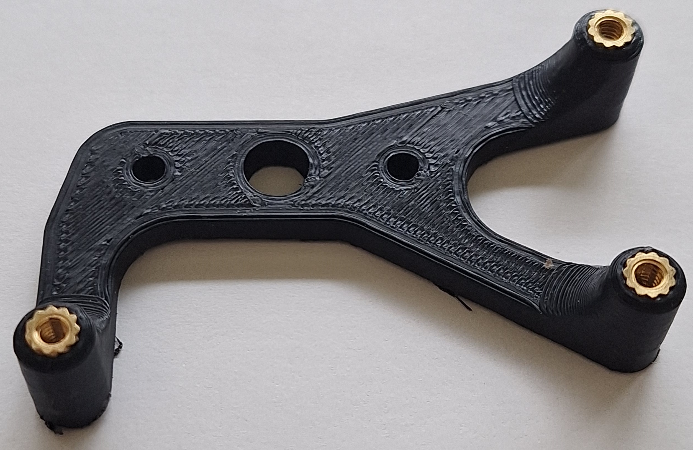
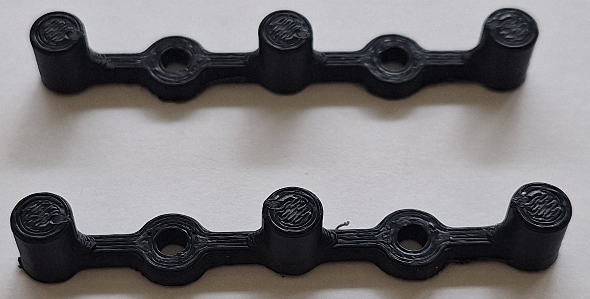

## [../](../)

# MEMSDuino 3d Print Files

Print all files in PLA. Use 4-40 brass thread inserts in HV-DCDC-bracket, arduino-bracket and front-panel-edge-bracket and 0-80 thread inserts in cryoelec-bracket.  Designs compatible with both hot press and press fit thread inserts.  This repository contains designs for five parts, and for each part there is an .STL file for sending to the 3d printer, a SolidWorks part file, a SolidWorks drawing file, a .pdf of the drawing, and an image of the pdf.  The zip file contains all five files for all 5 parts.  Which files you print depend on the use case, and are listed below in the list of STL files in this document.

 - [4-40 press fit brass thread inserts(EZ-LOK  ‎240-004-BR)](https://www.amazon.com/Z-LOK-Threaded-Insert-Plastic/dp/B08QJHXR7P/)
 - [0-80 Brass Thread Inserts(E-Z LOK 240-000-BR)](https://www.amazon.com/Z-LOK-Threaded-Insert-Plastic/dp/B08QJJDCW1/)
 - [3dprint-all-files.zip](3dprint-all-files.zip)

## COTS SP6T Build Bill of Materials

 - [7x 4-40 press fit brass thread inserts(EZ-LOK  ‎240-004-BR)](https://www.amazon.com/Z-LOK-Threaded-Insert-Plastic/dp/B08QJHXR7P/)
 - [4x 0-80 Brass Thread Inserts(E-Z LOK 240-000-BR)](https://www.amazon.com/Z-LOK-Threaded-Insert-Plastic/dp/B08QJJDCW1/)
 - 3/32" drill for pilot holes in wood
 - 7x 4-40 1/4" steel machine screws
 - 4x 0-80 1/4" machine screws
 - 6x #6 Phillips head wood screws
 - [arduino-bracket.STL (print 1)](arduino-bracket.STL)
 - [cryoelec-bracket.STL (print 1)](cryoelec-bracket.STL)
 - [front-panel-edge-bracket.STL (print 2)](front-panel-edge-bracket.STL)

## Custom SPnT build

 - [11x 4-40 press fit brass thread inserts(EZ-LOK  ‎240-004-BR)](https://www.amazon.com/Z-LOK-Threaded-Insert-Plastic/dp/B08QJHXR7P/)
  - 3/32" drill for pilot holes in wood
 - 11x 4-40 1/4" steel machine screws
 - 10x #6 Phillips head wood screws
 - [1x arduino-bracket.STL](arduino-bracket.STL)
 - [1x HV-DCDC-bracket.STL](HV-DCDC-bracket.STL)
 - [2x front-panel-center-bracket.STL](front-panel-center-bracket.STL)
 - [2x front-panel-edge-bracket.STL](front-panel-edge-bracket.STL)

## All STL Files

 - [HV-DCDC-bracket.STL(print 1, custom only) 4 g of filament, 14 minutes print time](HV-DCDC-bracket.STL)
 - [arduino-bracket.STL(print 1, all use cases) 4 g of filament, 17 minutes print time](arduino-bracket.STL)
 - [cryoelec-bracket.STL(print 1, for COTS controller) 4 g of filament, 16 minutes print time](cryoelec-bracket.STL)
 - [front-panel-center-bracket.STL(print 2, SP9T only) 1 g of filament, 7 minutes print time](front-panel-center-bracket.STL)
 - [front-panel-edge-bracket.STL(print 2, all use cases) 3 g of filament, 14 minutes print time](front-panel-edge-bracket.STL)
 - [MEMSduino-3dprint-STL.zip](MEMSduino-3dprint-STL.zip)

## Drawings

 
 
 
 
 

## Photos of Prints

## All Files

 - [HV-DCDC-bracket.SLDDRW](HV-DCDC-bracket.SLDDRW)
 - [HV-DCDC-bracket.SLDPRT](HV-DCDC-bracket.SLDPRT)
 - [HV-DCDC-bracket.STL](HV-DCDC-bracket.STL)
 - [HV-DCDC-bracket.pdf](HV-DCDC-bracket.pdf)
 - [HV-DCDC-bracket.png](HV-DCDC-bracket.png)
 - [arduino-bracket.SLDDRW](arduino-bracket.SLDDRW)
 - [arduino-bracket.SLDPRT](arduino-bracket.SLDPRT)
 - [arduino-bracket.STL](arduino-bracket.STL)
 - [arduino-bracket.pdf](arduino-bracket.pdf)
 - [arduino-bracket.png](arduino-bracket.png)
 - [cryoelec-bracket.SLDDRW](cryoelec-bracket.SLDDRW)
 - [cryoelec-bracket.SLDPRT](cryoelec-bracket.SLDPRT)
 - [cryoelec-bracket.STL](cryoelec-bracket.STL)
 - [cryoelec-bracket.pdf](cryoelec-bracket.pdf)
 - [cryoelec-bracket.png](cryoelec-bracket.png)
 - [front-panel-center-bracket.SLDDRW](front-panel-center-bracket.SLDDRW)
 - [front-panel-center-bracket.SLDPRT](front-panel-center-bracket.SLDPRT)
 - [front-panel-center-bracket.STL](front-panel-center-bracket.STL)
 - [front-panel-center-bracket.pdf](front-panel-center-bracket.pdf)
 - [front-panel-center-bracket.png](front-panel-center-bracket.png)
 - [front-panel-edge-bracket.SLDDRW](front-panel-edge-bracket.SLDDRW)
 - [front-panel-edge-bracket.SLDPRT](front-panel-edge-bracket.SLDPRT)
 - [front-panel-edge-bracket.STL](front-panel-edge-bracket.STL)
 - [front-panel-edge-bracket.pdf](front-panel-edge-bracket.pdf)
 - [front-panel-edge-bracket.png](front-panel-edge-bracket.png)

