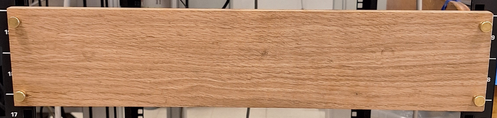
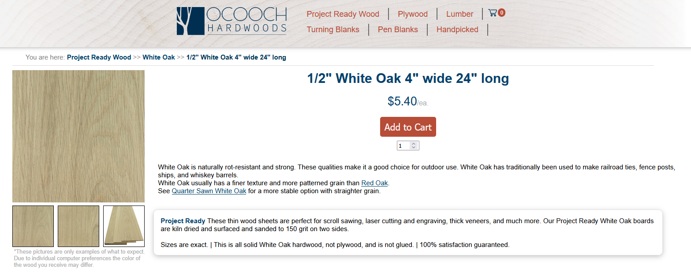
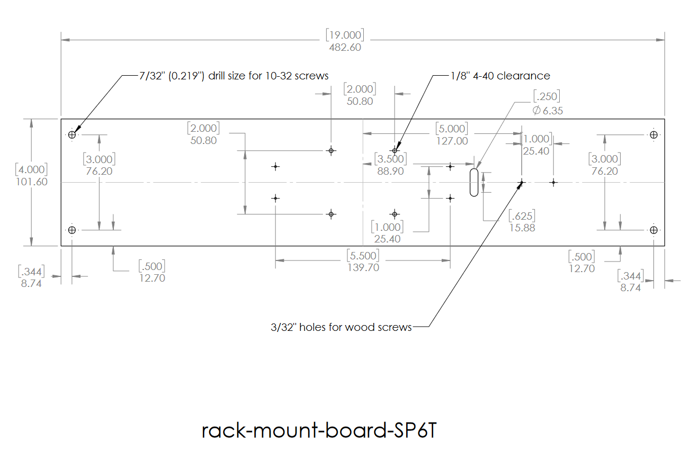
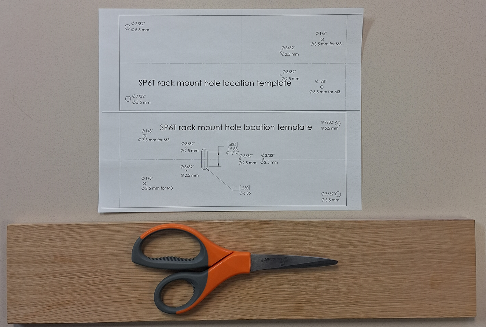
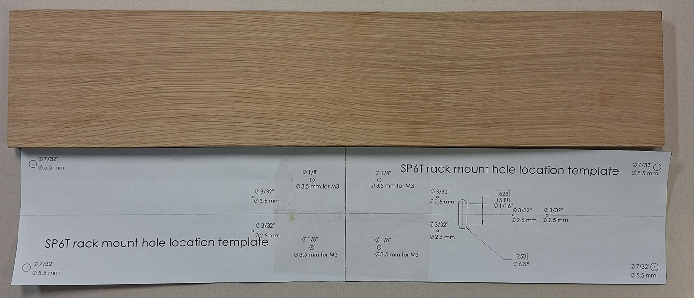
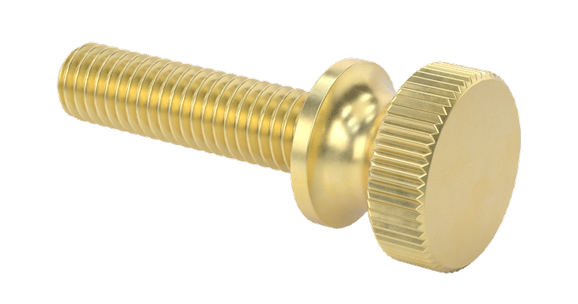

# Dual SP3T COTS


## Wood Board Fabrication and Assembly

Buy a 4 inch by 24 inch by half inch white oak board, cut down to 19 inches. Download and print out in 1:1 scale single sided the pdf linked below to 



[Link to buy board](https://ocoochhardwoods.com/detail/?i=124wo)

[](https://ocoochhardwoods.com/detail/?i=124wo)

[](rack-mount-board-SP6T.pdf)

[](rack-mount-board-SP6T.pdf)

[](rack-mount-board-SP6T.pdf)

[]()

[](https://github.com/lafefspietz/MEMSduino/raw/refs/heads/main/cryoelec-bracket-SP3T.STL)

# [MEMSDUINO: SP3T COTS](https://github.com/lafefspietz/MEMSduino/tree/main/SP3T-COTS)

Arduino-based control panel for [3PST switches](https://www.cryoelec.com/products/cryoswitchsp3t) from [Cryo-elec](https://www.cryoelec.com/).

To program over serial, connect at 9600 baud and send the character of the number you want to select. For example to select 1, send "1".

## BUILD GUIDE

1. Cut [1/2" thick 4" x 24" wood board](https://ocoochhardwoods.com/detail/?i=124wo) down to 19 inches wide
2. Download the template file [rack-mount-board-SP6T.pdf](https://github.com/lafefspietz/MEMSduino/blob/19722ce00cc25ea43800a57261b41cfc357cee65/rack-mount-board-SP6T.pdf) and print it out in 1:1 scale so that the dimensions are exactly correct, cut it out, and tape it together along the dotted line to form a single 19" x 4" template. Check that it is really the right size for the board.
3. Use a sharp tool to transfer hole locations from the paper template to the board, and drill holes as marked on the template. This can be done with a hand drill.
4. 3d print the plastic parts as follows:
    - [2 each of front-panel-edge-bracket.STL](https://github.com/lafefspietz/MEMSduino/raw/refs/heads/main/front-panel-edge-bracket.STL)
    - [1 of  cryoelec-bracket.STL](https://github.com/lafefspietz/MEMSduino/raw/refs/heads/main/cryoelec-bracket.STL)
    - [1 of arduino-bracket.STL](https://github.com/lafefspietz/MEMSduino/raw/refs/heads/main/arduino-bracket.STL)
5. Insert brass [4-40 brass thread inserts](https://www.3djake.com/ruthex/threaded-insert-4-40-unc-100-pieces)(7x) into Arduino bracket and front panel edge bracket with hot soldering iron
6. Insert brass [0-80 brass thread inserts](https://www.amazon.com/Z-LOK-Threaded-Insert-Plastic/dp/B08QJJDCW1/) upside down in cryo-elec bracket by simple force
7. Remove 24 pins from the [0.1" header strips](https://www.amazon.com/Header-Lystaii-Pin-Connector-Electronic/dp/B06ZZN8L9S/) and use them to solder the [Adafruit Neopixels](https://www.adafruit.com/product/1559), add the [10k resistors](https://www.digikey.com/en/products/detail/yageo/MFP-25BRD52-10K/2058797) and [buttons](https://www.digikey.com/en/products/detail/e-switch/TL59NF160Q/390533), and connect a [4 pin cable](https://www.amazon.com/ZYAMY-Dupont-Connector-Multicolor-Breadboard/dp/B0789F523N/) with one end cut and stripped to the header holes, with the red wire going to the 5v line.
8. Assemble the Arduino shield, double checking that the capacitor is not in backwards.
9. Buy an [AN-1304-A die cast aluminum enclosure](https://www.digikey.com/en/products/detail/bud-industries/AN-1304-A/5804538) from Bud Industries and have it modified using the drawings [AN-1304-A-box-modifications.pdf](https://github.com/lafefspietz/MEMSduino/raw/refs/heads/main/AN-1304-A-box-modifications.pdf) and [AN-1304-A-lid-modifications.pdf](https://github.com/lafefspietz/MEMSduino/raw/refs/heads/main/AN-1304-A-lid-modifications.pdf) and the STEP files [AN-1304-A-box-modifications.STEP](https://github.com/lafefspietz/MEMSduino/raw/refs/heads/main/AN-1304-A-box-modifications.STEP) and [AN-1304-A-lid-modifications.STEP](https://github.com/lafefspietz/MEMSduino/raw/refs/heads/main/AN-1304-A-lid-modifications.STEP). Or machine it yourself, if you have a mill.
10. Screw the Arduino bracket to one side of the wood and the two front panel brackets to the other side with the [#6 wood screws](https://www.amazon.com/Stainless-Phillips-Screws-Multipurpose-TPOHH/dp/B0CHRWGT8N). Screw the Arduino UNO to the Arduino bracket using the [1/4" #4 screws](https://www.mcmaster.com/90272A106/), as well as the front panel to the brackets on the front of the board, and insert the Arduino shield board into the sockets header strips on the Arduino.  Connect the [2 pin cable](https://www.amazon.com/ZYAMY-Dupont-Connector-Multicolor-Breadboard/dp/B0B8Z23NWX/), [4 pin cable](https://www.amazon.com/ZYAMY-Dupont-Connector-Multicolor-Breadboard/dp/B0789F523N/), and [8 pin cable](https://www.amazon.com/ZYAMY-Dupont-Connector-Multicolor-Breadboard/dp/B0789F2Y1T/ ) to the headers.
11. Insert [0.1" header strips](https://www.amazon.com/Header-Lystaii-Pin-Connector-Electronic/dp/B06ZZN8L9S/) into the input side of the DC DC boost board that comes with the SP6T switch from Cryoelec, screw them into place, and also screw into place the strip of jumpers on the output side.  Connect a [2 pin cable](https://www.amazon.com/ZYAMY-Dupont-Connector-Multicolor-Breadboard/dp/B0B8Z23NWX/), [4 pin cable](https://www.amazon.com/ZYAMY-Dupont-Connector-Multicolor-Breadboard/dp/B0789F523N/), and [8 pin cable](https://www.amazon.com/ZYAMY-Dupont-Connector-Multicolor-Breadboard/dp/B0789F2Y1T/ ) to the headers. 
12. Screw the 3d printed mounting bracket for the DC DC converter with the 0-80 thread inserts into the aluminum box with 1/4" 4-40 screws, and screw the DC DC converter board to the bracket with the [0-80 screws](https://www.amazon.com/Machine-Screws-Phillips-Stainless-Steel/dp/B07X8NTTB9/)
13. Screw the aluminum box to the wood board with the set of 4 [3/4" long 4-40 brass socket cap screws](https://www.mcmaster.com/93465A113/ ) and [washers](https://www.mcmaster.com/92916A320/).
14. Screw the [DSub solder cup connector](https://www.digikey.com/en/products/detail/norcomp-inc/171-025-103L001/858135) into the lid with the [4-40 hex standoffs](https://www.mcmaster.com/91075A462/)
15. Solder appropriate wires to socket cups for the pins on the bottom of the fridge which go to the switch.


## BILL OF MATERIALS

 - [1/2" White oak board, 4" x 24"](https://ocoochhardwoods.com/detail/?i=124wo)
 - [Brass Flared-Collar Knurled-Head Thumb Screws 10-32 Thread Size, 3/4" Long](https://www.mcmaster.com/92421A645/)
 - [#6 wood screws](https://www.amazon.com/Stainless-Phillips-Screws-Multipurpose-TPOHH/dp/B0CHRWGT8N)
 - [cryoelec-bracket](https://github.com/lafefspietz/MEMSduino/raw/refs/heads/main/cryoelec-bracket.STL)
 - [arduino-bracket](https://github.com/lafefspietz/MEMSduino/raw/refs/heads/main/arduino-bracket.STL)
 - [front-panel-edge-bracket](https://github.com/lafefspietz/MEMSduino/raw/refs/heads/main/front-panel-edge-bracket.STL)
 - [Brass threaded inserts #4-40](https://www.3djake.com/ruthex/threaded-insert-4-40-unc-100-pieces)
 - [0-80 Brass Thread Inserts(E-Z LOK 240-000-BR)](https://www.amazon.com/Z-LOK-Threaded-Insert-Plastic/dp/B08QJJDCW1/)
 - [0-80 screws  3/16" phillips, stainless](https://www.amazon.com/Machine-Screws-Phillips-Stainless-Steel/dp/B07X8NTTB9/)
 - [Zinc-Plated Steel Pan Head Phillips Screw 4-40 Thread, 1/4" Long](https://www.mcmaster.com/90272A106/)
 - [Diecast aluminum enclosure, AN-1304-A from BUD Industries](https://www.digikey.com/en/products/detail/bud-industries/AN-1304-A/5804538)
 - [Male-Female Threaded Hex Standoff 18-8 Stainless Steel, 3/16" Hex, 7/32" Long, 4-40 to 4-40 Thread](https://www.mcmaster.com/91075A462/)
 - [Brass Socket Head Screw 4-40 Thread Size, 3/4" Long](https://www.mcmaster.com/93465A113/ )
 - [Brass Washer for Number 4 Screw Size, 0.12" ID, 0.281" OD](https://www.mcmaster.com/92916A320/)
 - [6button-6neopixel, 152.4 mm x 88.9 mm (6""x3.5")](https://github.com/lafefspietz/MEMSduino/raw/refs/heads/main/6button-6neopixel-gerbers.zip)
 - [arduino-to-headers-shield 53.34 mm x 70.78 mm (2.1" x 2.79")](https://github.com/lafefspietz/MEMSduino/raw/refs/heads/main/arduino-to-headers-shield-gerbers.zip)
 - [100k axial resistor](https://www.digikey.com/en/products/detail/stackpole-electronics-inc/RNF14FTD100K/1706591)
 - [10k axial resistor](https://www.digikey.com/en/products/detail/yageo/MFR-25FBF52-10K/13219)
 - [330 ohm axial resistor](https://www.digikey.com/en/products/detail/stackpole-electronics-inc/CF18JT330R/1741683)
 - [1000 uF electrolytic capacitor](https://www.digikey.com/en/products/detail/rubycon/16PK1000MEFC10X12-5/3563556)
 - [Momentary buttons](https://www.digikey.com/en/products/detail/e-switch/TL59NF160Q/390533)
 - [JUMPER WIRE M/M 6" 20PCS](https://www.digikey.com/en/products/detail/sparkfun-electronics/PRT-12795/5993860)
 - [DB25 panel mount solder cup](https://www.digikey.com/en/products/detail/norcomp-inc/171-025-203L001/858144)
 - [Arduino UNO](https://www.digikey.com/en/products/detail/dfrobot/DFR0216/6579366)
 - [USB A to USB B cable](https://www.digikey.com/en/products/detail/assmann-wsw-components/AK672-2-2/947492)
 - [Neopixel programmable RGB LED](https://www.adafruit.com/product/1559)
 - [2 wire header cable](https://www.amazon.com/ZYAMY-Dupont-Connector-Multicolor-Breadboard/dp/B0B8Z23NWX/)
 - [4 wire header cable](https://www.amazon.com/ZYAMY-Dupont-Connector-Multicolor-Breadboard/dp/B0789F523N/)
 - [8 wire header cable](https://www.amazon.com/ZYAMY-Dupont-Connector-Multicolor-Breadboard/dp/B0789F2Y1T/ )
 - [0.1" headers](https://www.amazon.com/Header-Lystaii-Pin-Connector-Electronic/dp/B06ZZN8L9S/)


## Files

 - [cryoelec-bracket-SP3T.SLDDRW](https://github.com/lafefspietz/MEMSduino/raw/refs/heads/main/cryoelec-bracket-SP3T.SLDDRW)
 - [cryoelec-bracket-SP3T.SLDPRT](https://github.com/lafefspietz/MEMSduino/raw/refs/heads/main/cryoelec-bracket-SP3T.SLDPRT)
 - [cryoelec-bracket-SP3T.STL](https://github.com/lafefspietz/MEMSduino/raw/refs/heads/main/cryoelec-bracket-SP3T.STL)
 - [cryoelec-bracket-SP3T.pdf](https://github.com/lafefspietz/MEMSduino/raw/refs/heads/main/cryoelec-bracket-SP3T.pdf)
 - [6_port_controller.ino](https://github.com/lafefspietz/MEMSduino/raw/refs/heads/main/6_port_controller.ino)
 - [6button-6eopixel.SchDoc](https://github.com/lafefspietz/MEMSduino/raw/refs/heads/main/6button-6eopixel.SchDoc)
 - [6button-6neopixel-BOM.xlsx](https://github.com/lafefspietz/MEMSduino/raw/refs/heads/main/6button-6neopixel-BOM.xlsx)
 - [6button-6neopixel-gerbers.zip](https://github.com/lafefspietz/MEMSduino/raw/refs/heads/main/6button-6neopixel-gerbers.zip)
 - [6button-6neopixel.PcbDoc](https://github.com/lafefspietz/MEMSduino/raw/refs/heads/main/6button-6neopixel.PcbDoc)
 - [6button-6neopixels.PrjPcb](https://github.com/lafefspietz/MEMSduino/raw/refs/heads/main/6button-6neopixels.PrjPcb)
 - [6button-6neopixels.PrjPcbStructure](https://github.com/lafefspietz/MEMSduino/raw/refs/heads/main/6button-6neopixels.PrjPcbStructure)
 - [9-port-controller.ino](https://github.com/lafefspietz/MEMSduino/raw/refs/heads/main/9-port-controller.ino)
 - [AN-1304-A-box-modifications.SLDDRW](https://github.com/lafefspietz/MEMSduino/raw/refs/heads/main/AN-1304-A-box-modifications.SLDDRW)
 - [AN-1304-A-box-modifications.SLDPRT](https://github.com/lafefspietz/MEMSduino/raw/refs/heads/main/AN-1304-A-box-modifications.SLDPRT)
 - [AN-1304-A-box-modifications.STEP](https://github.com/lafefspietz/MEMSduino/raw/refs/heads/main/AN-1304-A-box-modifications.STEP)
 - [AN-1304-A-box-modifications.pdf](https://github.com/lafefspietz/MEMSduino/raw/refs/heads/main/AN-1304-A-box-modifications.pdf)
 - [AN-1304-A-lid-modifications.SLDDRW](https://github.com/lafefspietz/MEMSduino/raw/refs/heads/main/AN-1304-A-lid-modifications.SLDDRW)
 - [AN-1304-A-lid-modifications.SLDPRT](https://github.com/lafefspietz/MEMSduino/raw/refs/heads/main/AN-1304-A-lid-modifications.SLDPRT)
 - [AN-1304-A-lid-modifications.STEP](https://github.com/lafefspietz/MEMSduino/raw/refs/heads/main/AN-1304-A-lid-modifications.STEP)
 - [AN-1304-A-lid-modifications.pdf](https://github.com/lafefspietz/MEMSduino/raw/refs/heads/main/AN-1304-A-lid-modifications.pdf)
 - [arduino-bracket.SLDDRW](https://github.com/lafefspietz/MEMSduino/raw/refs/heads/main/arduino-bracket.SLDDRW)
 - [arduino-bracket.SLDPRT](https://github.com/lafefspietz/MEMSduino/raw/refs/heads/main/arduino-bracket.SLDPRT)
 - [arduino-bracket.STL](https://github.com/lafefspietz/MEMSduino/raw/refs/heads/main/arduino-bracket.STL)
 - [arduino-bracket.pdf](https://github.com/lafefspietz/MEMSduino/raw/refs/heads/main/arduino-bracket.pdf)
 - [arduino-to-headers-shield-BOM.xlsx](https://github.com/lafefspietz/MEMSduino/raw/refs/heads/main/arduino-to-headers-shield-BOM.xlsx)
 - [arduino-to-headers-shield-gerbers.zip](https://github.com/lafefspietz/MEMSduino/raw/refs/heads/main/arduino-to-headers-shield-gerbers.zip)
 - [arduino-to-headers-shield.PcbDoc](https://github.com/lafefspietz/MEMSduino/raw/refs/heads/main/arduino-to-headers-shield.PcbDoc)
 - [arduino-to-headers-shield.PrjPcb](https://github.com/lafefspietz/MEMSduino/raw/refs/heads/main/arduino-to-headers-shield.PrjPcb)
 - [arduino-to-headers-shield.PrjPcbStructure](https://github.com/lafefspietz/MEMSduino/raw/refs/heads/main/arduino-to-headers-shield.PrjPcbStructure)
 - [arduino-to-headers-shield.SchDoc](https://github.com/lafefspietz/MEMSduino/raw/refs/heads/main/arduino-to-headers-shield.SchDoc)
 - [cryoelec-bracket.SLDDRW](https://github.com/lafefspietz/MEMSduino/raw/refs/heads/main/cryoelec-bracket.SLDDRW)
 - [cryoelec-bracket.SLDPRT](https://github.com/lafefspietz/MEMSduino/raw/refs/heads/main/cryoelec-bracket.SLDPRT)
 - [cryoelec-bracket.STL](https://github.com/lafefspietz/MEMSduino/raw/refs/heads/main/cryoelec-bracket.STL)
 - [cryoelec-bracket.pdf](https://github.com/lafefspietz/MEMSduino/raw/refs/heads/main/cryoelec-bracket.pdf)
 - [front-panel-edge-bracket.SLDDRW](https://github.com/lafefspietz/MEMSduino/raw/refs/heads/main/front-panel-edge-bracket.SLDDRW)
 - [front-panel-edge-bracket.SLDPRT](https://github.com/lafefspietz/MEMSduino/raw/refs/heads/main/front-panel-edge-bracket.SLDPRT)
 - [front-panel-edge-bracket.STL](https://github.com/lafefspietz/MEMSduino/raw/refs/heads/main/front-panel-edge-bracket.STL)
 - [front-panel-edge-bracket.pdf](https://github.com/lafefspietz/MEMSduino/raw/refs/heads/main/front-panel-edge-bracket.pdf)
 - [rack-mount-board-SP6T.SLDDRW](https://github.com/lafefspietz/MEMSduino/raw/refs/heads/main/rack-mount-board-SP6T.SLDDRW)
 - [rack-mount-board-SP6T.SLDPRT](https://github.com/lafefspietz/MEMSduino/raw/refs/heads/main/rack-mount-board-SP6T.SLDPRT)
 - [rack-mount-board-SP6T.pdf](https://github.com/lafefspietz/MEMSduino/raw/refs/heads/main/rack-mount-board-SP6T.pdf)
 - [switch_control_matlab.m](https://github.com/lafefspietz/MEMSduino/raw/refs/heads/main/switch_control_matlab.m)
 - [switch_control_python.py](https://github.com/lafefspietz/MEMSduino/raw/refs/heads/main/switch_control_python.py)


## DRAWINGS


[](https://github.com/lafefspietz/MEMSduino/raw/refs/heads/main/cryoelec-bracket-SP3T.STL)

[](https://github.com/lafefspietz/MEMSduino/raw/refs/heads/main/arduino-bracket.STL)

[](https://github.com/lafefspietz/MEMSduino/raw/refs/heads/main/front-panel-edge-bracket.STL)

[](https://github.com/lafefspietz/MEMSduino/raw/refs/heads/main/rack-mount-board-SP6T.pdf)

[](https://github.com/lafefspietz/MEMSduino/raw/refs/heads/main/AN-1304-A-box-modifications.pdf)

[](https://github.com/lafefspietz/MEMSduino/raw/refs/heads/main/AN-1304-A-lid-modifications.pdf)

## BUILD IMAGES


## ARDUINO CODE

```

/*
*  This program uses the Arduino UNO to control a set of either 2 or 4 SP3T switches
*
*  Lafe Spietz, NIST, 2024
*/

#include <Adafruit_NeoPixel.h>
#ifdef __AVR__
#endif

// Which pin on the Arduino is connected to the NeoPixels?
// It is very important to change this based on if you have a Mega or UNO, since the A5 pin maps to different digital output pins
// A5 maps to 19 on the UNO and 59 on the Mega  

//#define PIN 59 // MEGA 
#define PIN 19 // UNO

// How many NeoPixels are attached to the Arduino?
#define NUMPIXELS 6 // 
//there are 6

// When setting up the NeoPixel library, we tell it how many pixels,  
// and which pin to use to send signals. Note that for older NeoPixel
// strips you might need to change the third parameter -- see the
// strandtest example for more information on possible values.
Adafruit_NeoPixel pixels(NUMPIXELS, PIN, NEO_GRB + NEO_KHZ800);


//define bit numbers on the Cryoelec controller and map them to Arduino pins

#define redCommon 2
#define red1_3 3
#define red2 4
#define red3_1 5
#define greenCommon 6
#define green1_3 7
#define green2 8
#define green3_1 9

int analog = 0;// variable which reads out the analog input from the button ladder
int delta = 20;//the acceptable difference between an analog value and an expected button state value
int redMode = 1;//modes are 1,2 or 3
int greenMode = 4;//modes are 4,5, or 6
int cycle = 0;//variable for cycling colors as test pattern with switch off

void setup() {
    Serial.begin(9600);//set the baud rate to 9600 baud.

    //Set all bits to digital output mode:
    pinMode(redCommon,OUTPUT);
    pinMode(red1_3,OUTPUT);
    pinMode(red2,OUTPUT);
    pinMode(red3_1,OUTPUT);
    pinMode(greenCommon,OUTPUT);
    pinMode(green1_3,OUTPUT);
    pinMode(green2,OUTPUT);
    pinMode(green3_1,OUTPUT);

    //set all pins low to start off with except common pins, which are high
    digitalWrite(redCommon,HIGH);
    digitalWrite(red1_3,LOW);
    digitalWrite(red2,LOW);
    digitalWrite(red3_1,LOW);
    digitalWrite(greenCommon,HIGH);
    digitalWrite(green1_3,LOW);
    digitalWrite(green2,LOW);
    digitalWrite(green3_1,LOW);

  pixels.begin(); // INITIALIZE NeoPixel strip object (REQUIRED)

}


void loop() {


  pixels.clear(); // Set all pixel colors to 'off'
  analog = analogRead(A4);//read the analog voltage from the button ladder
  // The first NeoPixel in a strand is #0, second is 1, all the way up
  // to the count of pixels minus one.
  
  // compare the analog value to all of the various button state values.  
  // This is a probe to see which node on a many-stage voltage divider
  //  is connected to the analog pin, which tests which button is pressed.
  // We check again after a milisecond to make sure the button state 
  // is stable and is not part of a transient signal.
  // There are two if statements for each value to ensure that the user has 
  // held the button in that state for at least a millisecond, 
  // in order to prevent responding to transient signal values

  if(analog > 1024 - delta){
    delay(1);
    analog = analogRead(A4);
    if(analog > 1023 - delta){
       redMode = 1;
    }
  }
  if(analog > 784 - delta && analog < 784 + delta){
    delay(1);
    analog = analogRead(A4);
    if(analog > 784 - delta && analog < 784 + delta){
       redMode = 2;
    }
  }
  if(analog > 596 - delta && analog < 596 + delta){
     delay(1);
     analog = analogRead(A4);
    if(analog > 596 - delta && analog < 596 + delta){
      redMode = 3;
    }
  }

  if(analog > 437 - delta && analog < 437 + delta){
     delay(1);
     analog = analogRead(A4);

    if(analog > 437 - delta && analog < 437 + delta){
      greenMode = 4;    
    }
  }

  if(analog > 290 - delta && analog < 290 + delta){
     delay(1);
     analog = analogRead(A4);

    if(analog > 290 - delta && analog < 290 + delta){
      greenMode = 5;    
    }
  }

  if(analog > 158 - delta && analog < 158 + delta){
     delay(1);
     analog = analogRead(A4);

    if(analog > 158 - delta && analog < 158 + delta){
      greenMode = 6;    
    }
  }


  if (Serial.available()) {

    //read serial as ascii integer
     int ser = Serial.read();
     if(ser == 48){    //ASCII for 0
      redMode = 0;
      greenMode = 0;
     }    
     if(ser == 49){    //ASCII for 1
       redMode = 1;
     }
     if(ser == 50){    //ASCII for 2
       redMode = 2;
     }
     if(ser == 51){    //ASCII for 3
       redMode = 3;
     }
     if(ser == 52){    //ASCII for 4
       greenMode = 4;
     }
     if(ser == 53){    //ASCII for 5
       greenMode = 5;
     }
     if(ser == 54){    //ASCII for 6
       greenMode = 6;
     }


  }

  if(redMode == 1){
    pixels.setPixelColor(5, pixels.Color(255, 0, 0));//red path device 1 select
    pixels.setPixelColor(4, pixels.Color(0, 0, 0));    
    pixels.setPixelColor(3, pixels.Color(0, 0, 0));    
    digitalWrite(red1_3,HIGH);
    digitalWrite(red2,LOW);
    digitalWrite(red3_1,LOW);    
  }
  if(redMode == 2){
    pixels.setPixelColor(5, pixels.Color(0, 0, 0));
    pixels.setPixelColor(4, pixels.Color(255, 0, 0));//red path device 2 select
    pixels.setPixelColor(3, pixels.Color(0, 0, 0));    
    digitalWrite(red1_3,LOW);
    digitalWrite(red2,HIGH);
    digitalWrite(red3_1,LOW);     
  }
  if(redMode == 3){
    pixels.setPixelColor(5, pixels.Color(0, 0, 0));
    pixels.setPixelColor(4, pixels.Color(0, 0, 0));    
    pixels.setPixelColor(3, pixels.Color(255, 0, 0));//red path device 3 select    
    digitalWrite(red1_3,LOW);
    digitalWrite(red2,LOW);
    digitalWrite(red3_1,HIGH);     
  }
  if(greenMode == 4){
    pixels.setPixelColor(2, pixels.Color(0, 255, 0));//green path device 4 select    
    pixels.setPixelColor(1, pixels.Color(0, 0, 0));    
    pixels.setPixelColor(0, pixels.Color(0, 0, 0));    
    digitalWrite(green1_3,HIGH);
    digitalWrite(green2,LOW);
    digitalWrite(green3_1,LOW);
  }
  if(greenMode == 5){
    pixels.setPixelColor(2, pixels.Color(0, 0, 0));    
    pixels.setPixelColor(1, pixels.Color(0, 255, 0));//green path device 5 select    
    pixels.setPixelColor(0, pixels.Color(0, 0, 0));    
    digitalWrite(green1_3,LOW);
    digitalWrite(green2,HIGH);
    digitalWrite(green3_1,LOW);
  }
  if(greenMode == 6){
    pixels.setPixelColor(2, pixels.Color(0, 0, 0));    
    pixels.setPixelColor(1, pixels.Color(0, 0, 0));    
    pixels.setPixelColor(0, pixels.Color(0, 255, 0));//green path device 6 select    
    digitalWrite(green1_3,LOW);
    digitalWrite(green2,LOW);
    digitalWrite(green3_1,HIGH);
  }

  if(redMode == 0){
    
    pixels.setPixelColor(0, pixels.Color(0, 0, 0));    
    pixels.setPixelColor(1, pixels.Color(0, 0, 0));    
    pixels.setPixelColor(2, pixels.Color(0, 0, 0));    
    pixels.setPixelColor(3, pixels.Color(0, 0, 0));    
    pixels.setPixelColor(4, pixels.Color(0, 0, 0));    
    pixels.setPixelColor(5, pixels.Color(0, 0, 0));      
    
    digitalWrite(red1_3,LOW);
    digitalWrite(red2,LOW);
    digitalWrite(red3_1,LOW);
    digitalWrite(green1_3,LOW);
    digitalWrite(green2,LOW);
    digitalWrite(green3_1,LOW);

  }

  pixels.show();   // Send the updated pixel colors to the hardware.
  delay(1); // Pause before next pass through loop


}


```


## PYTHON CODE


```
import serial
ser = serial.Serial('COM12', 9600)  # open serial port, replace with correct COM port, found from IDE
ser.write(bytes(str(1), encoding='utf-8')) # replace the number 1 with port number
```

## MATLAB CODE

```

% Use the instrument control app to see what com ports are  connected and
% try connecting and testing. You can also use the Arduino IDE to find out
% what port the Arduino is on.  Change the baud rate to 115200 to interact
% with the serial.  Just send numbers 1 through 9 down the serial to change
% the state.  

switch_controller = instrfind('Type', 'serial', 'Port', 'COM10', 'Tag', '');

% Create the serial port object if it does not exist
% otherwise use the object that was found.
if isempty(switch_controller)
    switch_controller = serial('COM10');
else
    fclose(switch_controller);
    switch_controller = switch_controller(1);
end

fopen(switch_controller);
switch_controller.BaudRate = 9600;

%% bouncing lights test pattern

while true
    for n = 1:9
       fprintf(switch_controller,int2str(n))
       pause(0.05);
    
    end
    
    for n = 1:9
        
       fprintf(switch_controller,int2str(10-n))
       pause(0.05);
    
    end
end


%%  Step switch and take trace

for n = 1:9 
    smatrix.switch1 = n;    
    fprintf(switchotron1,int2str(smatrix.switch1));
    pause(2);
    % take and save trace here

end
```

## LICENSE

This data/work was created by employees of the National Institute of Standards and Technology (NIST), an agency of the Federal Government. Pursuant to title 17 United States Code Section 105, works of NIST employees are not subject to copyright protection in the United States.  This data/work may be subject to foreign copyright.

The data/work is provided by NIST as a public service and is expressly provided “AS IS.” NIST MAKES NO WARRANTY OF ANY KIND, EXPRESS, IMPLIED OR STATUTORY, INCLUDING, WITHOUT LIMITATION, THE IMPLIED WARRANTY OF MERCHANTABILITY, FITNESS FOR A PARTICULAR PURPOSE, NON-INFRINGEMENT AND DATA ACCURACY. NIST does not warrant or make any representations regarding the use of the data or the results thereof, including but not limited to the correctness, accuracy, reliability or usefulness of the data. NIST SHALL NOT BE LIABLE AND YOU HEREBY RELEASE NIST FROM LIABILITY FOR ANY INDIRECT, CONSEQUENTIAL, SPECIAL, OR INCIDENTAL DAMAGES (INCLUDING DAMAGES FOR LOSS OF BUSINESS PROFITS, BUSINESS INTERRUPTION, LOSS OF BUSINESS INFORMATION, AND THE LIKE), WHETHER ARISING IN TORT, CONTRACT, OR OTHERWISE, ARISING FROM OR RELATING TO THE DATA (OR THE USE OF OR INABILITY TO USE THIS DATA), EVEN IF NIST HAS BEEN ADVISED OF THE POSSIBILITY OF SUCH DAMAGES.

To the extent that NIST may hold copyright in countries other than the United States, you are hereby granted the non-exclusive irrevocable and unconditional right to print, publish, prepare derivative works and distribute the NIST data, in any medium, or authorize others to do so on your behalf, on a royalty-free basis throughout the world.

You may improve, modify, and create derivative works of the data or any portion of the data, and you may copy and distribute such modifications or works. Modified works should carry a notice stating that you changed the data and should note the date and nature of any such change. Please explicitly acknowledge the National Institute of Standards and Technology as the source of the data:  Data citation recommendations are provided at https://www.nist.gov/open/license.

Permission to use this data is contingent upon your acceptance of the terms of this agreement and upon your providing appropriate acknowledgments of NIST’s creation of the data/work.