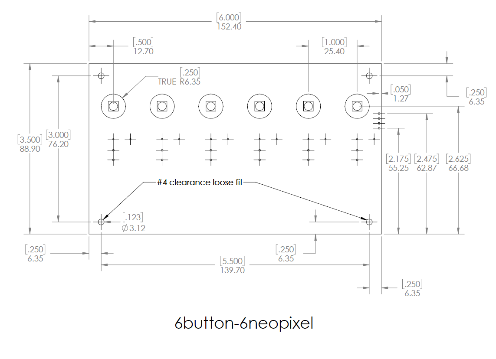
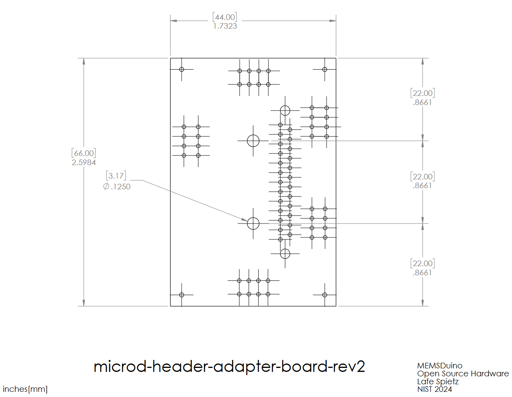
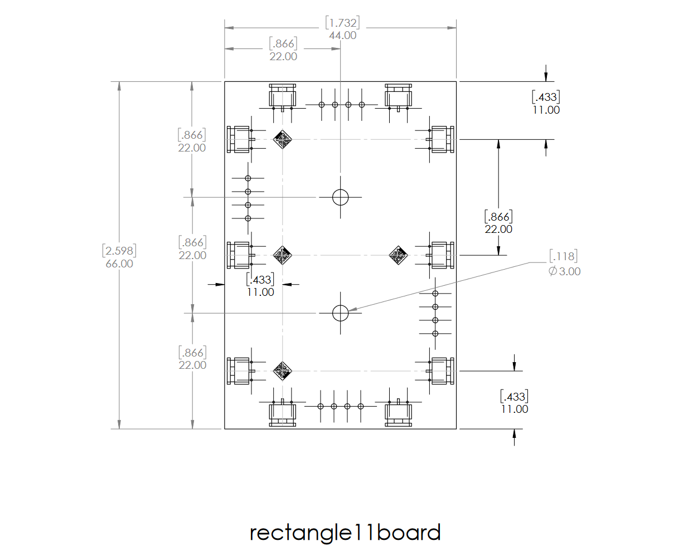
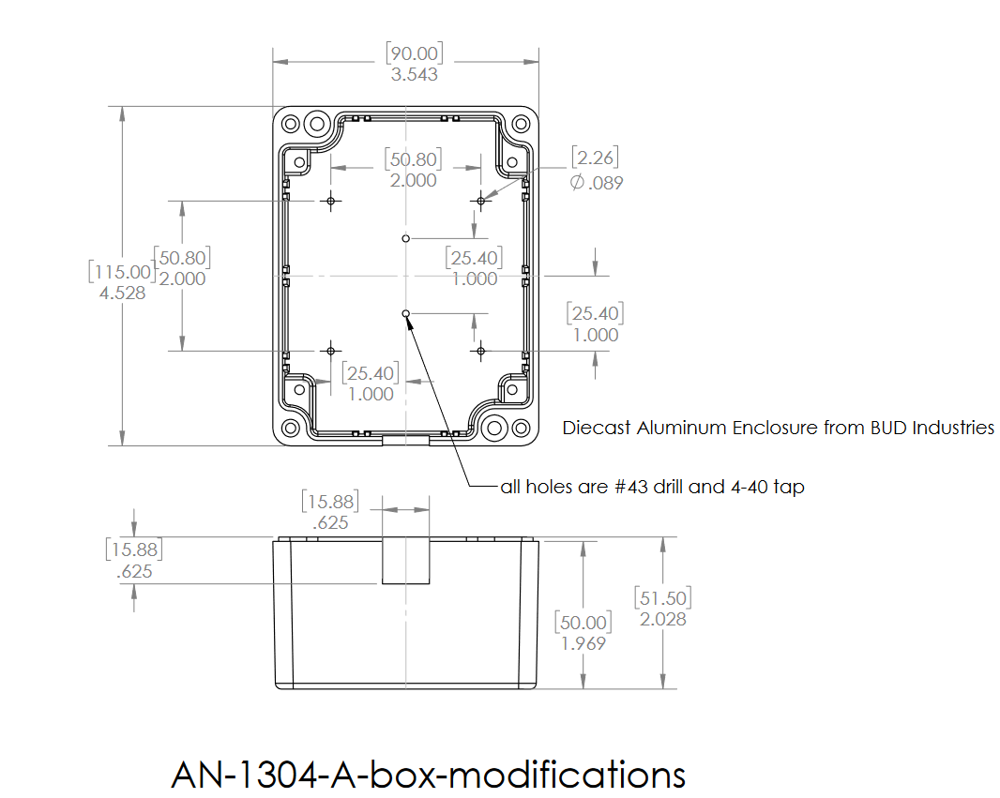
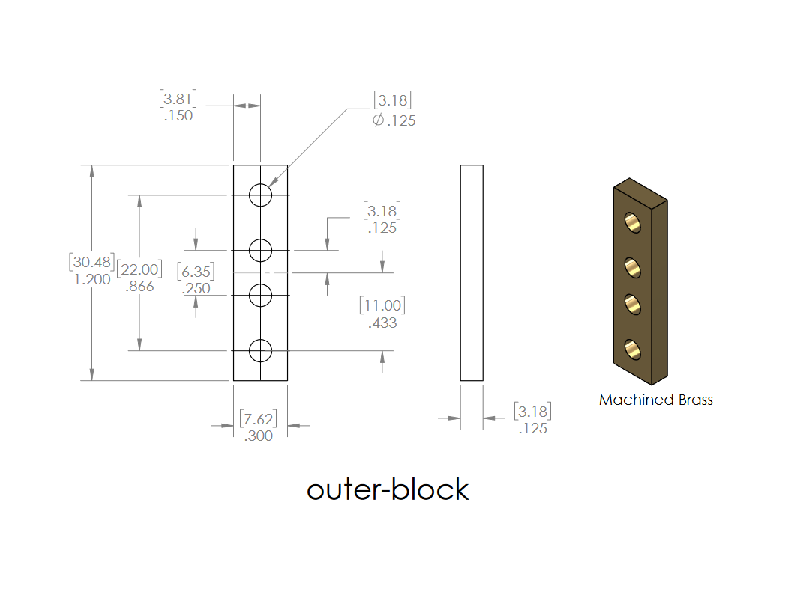
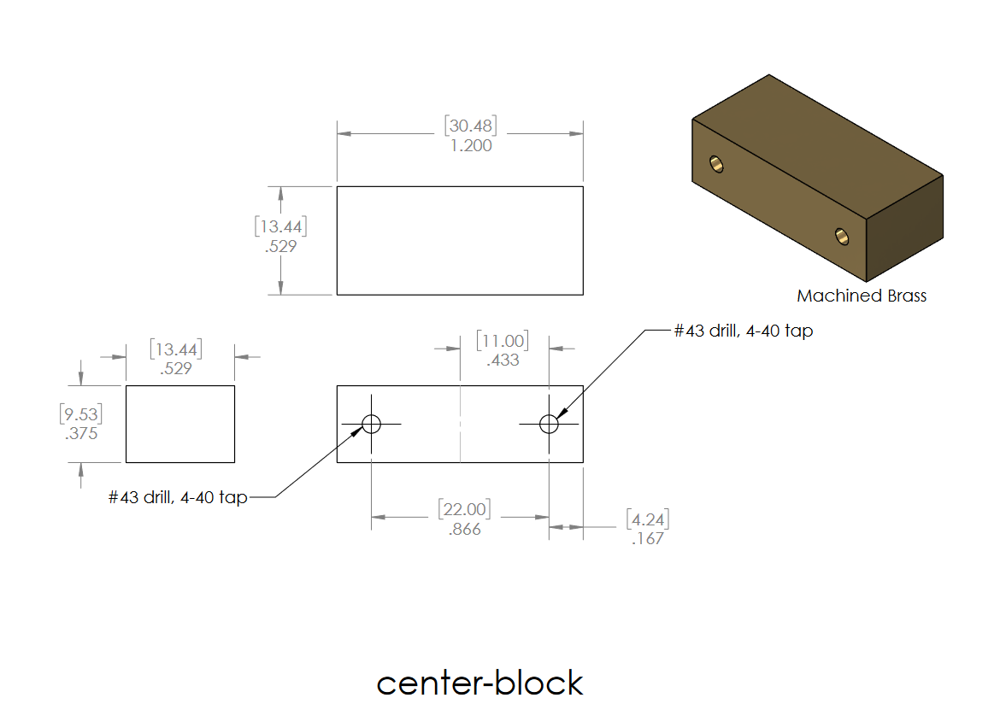
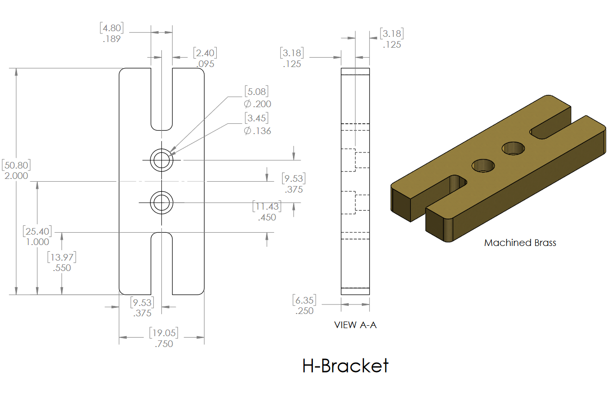
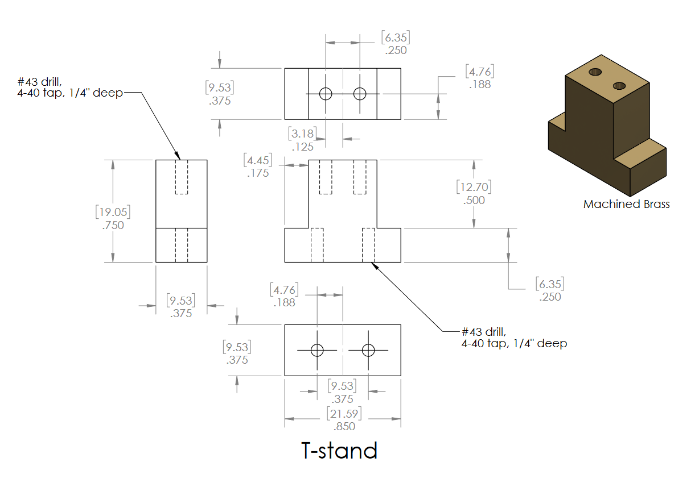

# [MEMSduino: Arduino-Based Controller for MEMS Switches](https://github.com/lafefspietz/MEMSduino/)

Open source system for controlling MEMS switches using an Arduino.

## [System Bill of Materials](BOM.xlsx)

# Circuit Board Files

 - [9button-9neopixel Altium Schematic File](pcb/9button-9neopixel.schDoc)
 - [9button-9neopixel Altium Pcb File](pcb/9button-9neopixel.PcbDoc)
 - [9button-9neopixel Altium Project File](pcb/9button-9neopixel.PrjPcb)
 - [9button-9neopixel .zip of Gerber files](pcb/9button-9neopixel-gerbers.zip)
 - [8button-8neopixel Altium Schematic File](pcb/8button-8neopixel.schDoc)
 - [8button-8neopixel Altium Pcb File](pcb/8button-8neopixel.PcbDoc)
 - [8button-8neopixel Altium Project File](pcb/8button-8neopixel.PrjPcb)
 - [8button-8neopixel .zip of Gerber files](pcb/8button-8neopixel-gerbers.zip)
 - [6button-6neopixel Altium Schematic File](pcb/6button-6neopixel.schDoc)
 - [6button-6neopixel Altium Pcb File](pcb/6button-6neopixel.PcbDoc)
 - [6button-6neopixel Altium Project File](pcb/6button-6neopixel.PrjPcb)
 - [6button-6neopixel .zip of Gerber files](pcb/6button-6neopixel-gerbers.zip)
 - [6button-6neopixel.pdf](pcb/6button-6neopixel.pdf)
 - [arduino-to-headers-shield Altium Schematic File](pcb/arduino-to-headers-shield.schDoc)
 - [arduino-to-headers-shield Altium Project File](pcb/arduino-to-headers-shield.PrjPcb)
 - [arduino-to-headers-shield Altium Pcb File ](pcb/arduino-to-headers-shield.PcbDoc)
 - [arduino-to-headers-shield .zip of Gerber files](pcb/arduino-to-headers-shield-gerbers.zip)
 - [DB25-relay-HV-control Altium Schematic File](pcb/DB25-relay-HV-control.schDoc)
 - [DB25-relay-HV-control Altium Project File](pcb/DB25-relay-HV-control.PrjPcb)
 - [DB25-relay-HV-control Altium Pcb File](pcb/DB25-relay-HV-control.PcbDoc)
 - [DB25-relay-HV-control .zip of Gerber files](pcb/DB25-relay-HV-control-gerbers.zip)
 - [microd-header-adapter-board-rev2 Altium Schematic File](pcb/microd-header-adapter-board-rev2.schDoc)
 - [microd-header-adapter-board-rev2 Altium Project File](pcb/microd-header-adapter-board-rev2.PrjPcb)
 - [microd-header-adapter-board-rev2 Altium Pcb File](pcb/microd-header-adapter-board-rev2.PcbDoc)
 - [microd-header-adapter-board-rev2 .zip of Gerber files](pcb/microd-header-adapter-board-rev2-gerbers.zip)
 - [rectangle11board Altium Schematic File](pcb/rectangle11board.schDoc)
 - [rectangle11board Altium Project File](pcb/rectangle11board.PrjPcb)
 - [rectangle11board Altium Pcb File](pcb/rectangle11board.PcbDoc)
 - [rectangle11board .zip of Gerber files](pcb/rectangle11board.zip)
 - [cal-boards-panelization1 Bill of Materials](pcb/cal-boards-panelization1-BOM.xlsx)
 - [cal-boards-panelization1 Altium Pcb File](pcb/cal-boards-panelization1.PcbDoc)
 - [cal-boards-panelization1 .zip of Gerber files](pcb/cal-boards-panelization1-gerbers.zip)
 - [SchlibLafe.SchLib Library File](pcb/SchlibLafe.SchLib)
 - [PcbLibLafe.PcbLib Library File](pcb/PcbLibLafe.PcbLib)
 - [Fiducial.SchLib Library File](pcb/Fiducial.SchLib)
 - [Fiducial.PcbLib Library File](pcb/Fiducial.PcbLib)
 - [pogo_socket_2port.PcbDoc](pcb/pogo_socket_2port.PcbDoc)
 - [pogo_socket_6port.PcbDoc](pcb/pogo_socket_6port.PcbDoc)
 - [cal-boards-zip.zip](pcb/cal-boards-zip.zip)

# Circuit Board Drawings

# 3d Print Files

 - [front-panel-edge-bracket.STL](3dprint/front-panel-edge-bracket.STL)
 - [front-panel-center-bracket.STL](3dprint/front-panel-center-bracket.STL)
 - [arduino-bracket.STL](3dprint/arduino-bracket.STL)
 - [HV-DCDC-bracket.STL](3dprint/HV-DCDC-bracket.STL) 
 - [arduino-bracket.SLDPRT](3dprint/arduino-bracket.SLDPRT)
 - [front-panel-center-bracket.SLDPRT](3dprint/front-panel-center-bracket.SLDPRT)
 - [arduino-bracket.SLDPRT](3dprint/arduino-bracket.SLDPRT)
 - [HV-DCDC-bracket.SLDPRT](3dprint/HV-DCDC-bracket.SLDPRT) 

# Machining Files

 - [.pdf Drawing for Box](machining/AN-1304-A-box-modifications.pdf)
 - [SolidWorks part file for Box](machining/AN-1304-A-box-modifications.SLDPRT)
 - [SolidWorks drawing file for Box](machining/AN-1304-A-box-modifications.SLDDRW)
 - [STEP file for Box](machining/AN-1304-A-box-modifications.STEP)
 - [.pdf Drawing for Lid](machining/AN-1304-A-lid-modifications.pdf)
 - [SolidWorks part file for Lid](machining/AN-1304-A-lid-modifications.SLDPRT)
 - [SolidWorks drawing file for Lid](machining/AN-1304-A-lid-modifications.SLDDRW)
 - [STEP file for Lid](machining/AN-1304-A-lid-modifications.STEP)
 - [.pdf Drawing for Outer Block](machining/outer-block.pdf)
 - [outer-block.SLDDRW](machining/outer-block.SLDDRW)
 - [outer-block.SLDPRT](machining/outer-block.SLDPRT)
 - [.pdf Drawing for Center Block](machining/center-block.pdf)
 - [SolidWorks Drawing for Center Block](machining/center-block.SLDDRW)
 - [SolidWorks Part File for Center Block](machining/center-block.SLDPRT)
 - [.pdf Drawing of H Bracket](machining/H-Bracket.pdf)
 - [SolidWorks Drawing for H Bracket](machining/H-Bracket.SLDDRW)
 - [SolidWorks Part File for H Bracket](machining/H-Bracket.SLDPRT)
 - [.pdf Drawing for T stand](machining/T-stand.pdf)
 - [SolidWorks Drawing File for T stand](machining/T-stand.SLDDRW)
 - [SolidWorks Part File for T Stand](machining/T-stand.SLDPRT)

# Wood Files

 - [.pdf for Rack Mount Wood Board](wood/rack-mount-board.pdf)
 - [SolidWorks Drawing File for Rack Mount Wood Board](wood/rack-mount-board.SLDDRW)
 - [SolidWorks Part File for Rack Mount Wood Board](wood/rack-mount-board.SLDPRT)
 - [.pdf for Rack Mount Wood Board](wood/rack-mount-board-SP6T.pdf)
 - [SolidWorks Drawing File for Rack Mount Wood Board](wood/rack-mount-board-SP6T.SLDDRW)
 - [SolidWorks Part File for Rack Mount Wood Board](wood/rack-mount-board-SP6T.SLDPRT)

# Arduino Code

 - [arduino/9-port-controller.ino](arduino/9-port-controller/9-port-controller.ino)
 - [arduino/8_port_ecal_controller.ino](arduino/8_port_ecal_controller/8_port_ecal_controller.ino)
 - [arduino/6_port_controller.ino](arduino/6_port_controller/6_port_controller.ino)

# Matlab Switch Control

 - [matlab/switch_control.m](matlab/switch_control.m)

# Jupyter Notebook with Python Control

 - [jupyter/switch_control.ipynb](jupyter/switch_control.ipynb)

## Disclaimer

Certain equipment, instruments, software, or materials are identified in this document in order to specify the experimental procedure adequately.  Such identification is not intended to imply recommendation or endorsement of any product or service by NIST, nor is it intended to imply that the materials or equipment identified are necessarily the best available for the purpose.

## License

This data/work was created by employees of the National Institute of Standards and Technology (NIST), an agency of the Federal Government. Pursuant to title 17 United States Code Section 105, works of NIST employees are not subject to copyright protection in the United States.  This data/work may be subject to foreign copyright.

The data/work is provided by NIST as a public service and is expressly provided “AS IS.” NIST MAKES NO WARRANTY OF ANY KIND, EXPRESS, IMPLIED OR STATUTORY, INCLUDING, WITHOUT LIMITATION, THE IMPLIED WARRANTY OF MERCHANTABILITY, FITNESS FOR A PARTICULAR PURPOSE, NON-INFRINGEMENT AND DATA ACCURACY. NIST does not warrant or make any representations regarding the use of the data or the results thereof, including but not limited to the correctness, accuracy, reliability or usefulness of the data. NIST SHALL NOT BE LIABLE AND YOU HEREBY RELEASE NIST FROM LIABILITY FOR ANY INDIRECT, CONSEQUENTIAL, SPECIAL, OR INCIDENTAL DAMAGES (INCLUDING DAMAGES FOR LOSS OF BUSINESS PROFITS, BUSINESS INTERRUPTION, LOSS OF BUSINESS INFORMATION, AND THE LIKE), WHETHER ARISING IN TORT, CONTRACT, OR OTHERWISE, ARISING FROM OR RELATING TO THE DATA (OR THE USE OF OR INABILITY TO USE THIS DATA), EVEN IF NIST HAS BEEN ADVISED OF THE POSSIBILITY OF SUCH DAMAGES.

To the extent that NIST may hold copyright in countries other than the United States, you are hereby granted the non-exclusive irrevocable and unconditional right to print, publish, prepare derivative works and distribute the NIST data, in any medium, or authorize others to do so on your behalf, on a royalty-free basis throughout the world.

You may improve, modify, and create derivative works of the data or any portion of the data, and you may copy and distribute such modifications or works. Modified works should carry a notice stating that you changed the data and should note the date and nature of any such change. Please explicitly acknowledge the National Institute of Standards and Technology as the source of the data:  Data citation recommendations are provided at https://www.nist.gov/open/license.

Permission to use this data is contingent upon your acceptance of the terms of this agreement and upon your providing appropriate acknowledgments of NIST’s creation of the data/work.

