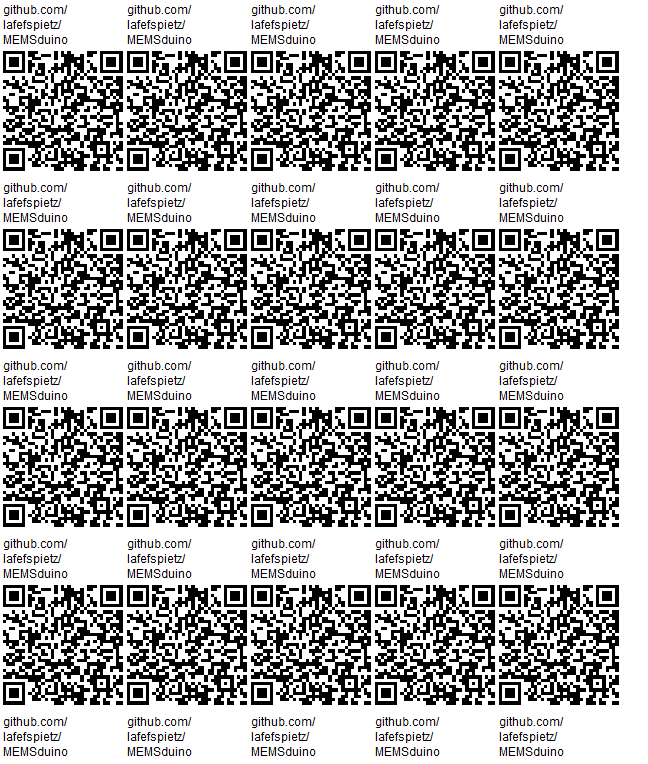
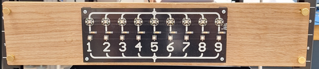
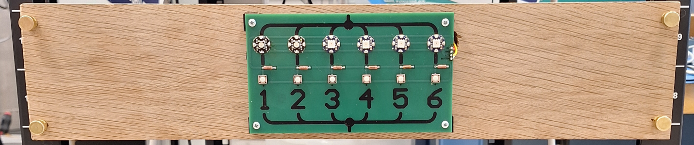
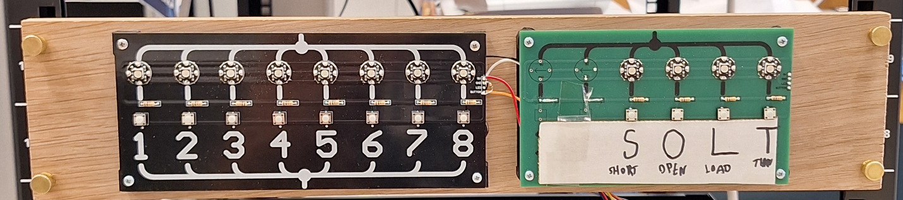

# [MEMSduino: Arduino-Based Controller for MEMS Switches](https://github.com/lafefspietz/MEMSduino/)

## [files.html](files.html)

Open source system for controlling MEMS switches using an Arduino.  This system allows for both serial control via software and physical control by a human operator with buttons and indicator lights of a range of possible MEMS switch configurations.  A set of relays are controlled by the Arduino, which determines which of the lines on a DSUB connector are energized with a 90 volt signal.  This DSUB can then be connected to any cryogenic wiring which leads to the various DC control lines of a cryogenic MEMS RF switch.  

## [SP6T-COTS/](SP6T-COTS/)

## [SP3T-COTS/](SP3T-COTS/)

## [SP9T/](SP9T/)

## [METAL BOX](metal-box/)

## [arXiv preprint DOI](https://arxiv.org/abs/2501.03340)

## All Files

 - [6_port_controller.ino](https://github.com/lafefspietz/MEMSduino/raw/refs/heads/main/6_port_controller.ino)
 - [6button-6eopixel.SchDoc](https://github.com/lafefspietz/MEMSduino/raw/refs/heads/main/6button-6eopixel.SchDoc)
 - [6button-6neopixel-BOM.xlsx](https://github.com/lafefspietz/MEMSduino/raw/refs/heads/main/6button-6neopixel-BOM.xlsx)
 - [6button-6neopixel-gerbers.zip](https://github.com/lafefspietz/MEMSduino/raw/refs/heads/main/6button-6neopixel-gerbers.zip)
 - [6button-6neopixel.PcbDoc](https://github.com/lafefspietz/MEMSduino/raw/refs/heads/main/6button-6neopixel.PcbDoc)
 - [6button-6neopixels.PrjPcb](https://github.com/lafefspietz/MEMSduino/raw/refs/heads/main/6button-6neopixels.PrjPcb)
 - [6button-6neopixels.PrjPcbStructure](https://github.com/lafefspietz/MEMSduino/raw/refs/heads/main/6button-6neopixels.PrjPcbStructure)
 - [9-port-controller.ino](https://github.com/lafefspietz/MEMSduino/raw/refs/heads/main/9-port-controller.ino)
 - [9button-9neopixel-BOM.xlsx](https://github.com/lafefspietz/MEMSduino/raw/refs/heads/main/9button-9neopixel-BOM.xlsx)
 - [9button-9neopixel-gerbers.zip](https://github.com/lafefspietz/MEMSduino/raw/refs/heads/main/9button-9neopixel-gerbers.zip)
 - [9button-9neopixel.PcbDoc](https://github.com/lafefspietz/MEMSduino/raw/refs/heads/main/9button-9neopixel.PcbDoc)
 - [9button-9neopixel.SchDoc](https://github.com/lafefspietz/MEMSduino/raw/refs/heads/main/9button-9neopixel.SchDoc)
 - [9button-9neopixels.PrjPcb](https://github.com/lafefspietz/MEMSduino/raw/refs/heads/main/9button-9neopixels.PrjPcb)
 - [9button-9neopixels.PrjPcbStructure](https://github.com/lafefspietz/MEMSduino/raw/refs/heads/main/9button-9neopixels.PrjPcbStructure)
 - [AN-1304-A-box-modifications.SLDDRW](https://github.com/lafefspietz/MEMSduino/raw/refs/heads/main/AN-1304-A-box-modifications.SLDDRW)
 - [AN-1304-A-box-modifications.SLDPRT](https://github.com/lafefspietz/MEMSduino/raw/refs/heads/main/AN-1304-A-box-modifications.SLDPRT)
 - [AN-1304-A-box-modifications.STEP](https://github.com/lafefspietz/MEMSduino/raw/refs/heads/main/AN-1304-A-box-modifications.STEP)
 - [AN-1304-A-box-modifications.pdf](https://github.com/lafefspietz/MEMSduino/raw/refs/heads/main/AN-1304-A-box-modifications.pdf)
 - [AN-1304-A-lid-modifications.SLDDRW](https://github.com/lafefspietz/MEMSduino/raw/refs/heads/main/AN-1304-A-lid-modifications.SLDDRW)
 - [AN-1304-A-lid-modifications.SLDPRT](https://github.com/lafefspietz/MEMSduino/raw/refs/heads/main/AN-1304-A-lid-modifications.SLDPRT)
 - [AN-1304-A-lid-modifications.STEP](https://github.com/lafefspietz/MEMSduino/raw/refs/heads/main/AN-1304-A-lid-modifications.STEP)
 - [AN-1304-A-lid-modifications.pdf](https://github.com/lafefspietz/MEMSduino/raw/refs/heads/main/AN-1304-A-lid-modifications.pdf)
 - [DB25-relay-HV-control-BOM.xlsx](https://github.com/lafefspietz/MEMSduino/raw/refs/heads/main/DB25-relay-HV-control-BOM.xlsx)
 - [DB25-relay-HV-control-gerbers.zip](https://github.com/lafefspietz/MEMSduino/raw/refs/heads/main/DB25-relay-HV-control-gerbers.zip)
 - [DB25-relay-HV-control.PcbDoc](https://github.com/lafefspietz/MEMSduino/raw/refs/heads/main/DB25-relay-HV-control.PcbDoc)
 - [DB25-relay-HV-control.PrjPcb](https://github.com/lafefspietz/MEMSduino/raw/refs/heads/main/DB25-relay-HV-control.PrjPcb)
 - [DB25-relay-HV-control.PrjPcbStructure](https://github.com/lafefspietz/MEMSduino/raw/refs/heads/main/DB25-relay-HV-control.PrjPcbStructure)
 - [DB25-relay-HV-control.SchDoc](https://github.com/lafefspietz/MEMSduino/raw/refs/heads/main/DB25-relay-HV-control.SchDoc)
 - [HV-DCDC-bracket.SLDDRW](https://github.com/lafefspietz/MEMSduino/raw/refs/heads/main/HV-DCDC-bracket.SLDDRW)
 - [HV-DCDC-bracket.SLDPRT](https://github.com/lafefspietz/MEMSduino/raw/refs/heads/main/HV-DCDC-bracket.SLDPRT)
 - [HV-DCDC-bracket.STL](https://github.com/lafefspietz/MEMSduino/raw/refs/heads/main/HV-DCDC-bracket.STL)
 - [HV-DCDC-bracket.pdf](https://github.com/lafefspietz/MEMSduino/raw/refs/heads/main/HV-DCDC-bracket.pdf)
 - [SP6T-COTS-BOM.xlsx](https://github.com/lafefspietz/MEMSduino/raw/refs/heads/main/SP6T-COTS-BOM.xlsx)
 - [SP9T-Custom-BOM.xlsx](https://github.com/lafefspietz/MEMSduino/raw/refs/heads/main/SP9T-Custom-BOM.xlsx)
 - [arduino-bracket.SLDDRW](https://github.com/lafefspietz/MEMSduino/raw/refs/heads/main/arduino-bracket.SLDDRW)
 - [arduino-bracket.SLDPRT](https://github.com/lafefspietz/MEMSduino/raw/refs/heads/main/arduino-bracket.SLDPRT)
 - [arduino-bracket.STL](https://github.com/lafefspietz/MEMSduino/raw/refs/heads/main/arduino-bracket.STL)
 - [arduino-bracket.pdf](https://github.com/lafefspietz/MEMSduino/raw/refs/heads/main/arduino-bracket.pdf)
 - [arduino-to-headers-shield-BOM.xlsx](https://github.com/lafefspietz/MEMSduino/raw/refs/heads/main/arduino-to-headers-shield-BOM.xlsx)
 - [arduino-to-headers-shield-gerbers.zip](https://github.com/lafefspietz/MEMSduino/raw/refs/heads/main/arduino-to-headers-shield-gerbers.zip)
 - [arduino-to-headers-shield.PcbDoc](https://github.com/lafefspietz/MEMSduino/raw/refs/heads/main/arduino-to-headers-shield.PcbDoc)
 - [arduino-to-headers-shield.PrjPcb](https://github.com/lafefspietz/MEMSduino/raw/refs/heads/main/arduino-to-headers-shield.PrjPcb)
 - [arduino-to-headers-shield.PrjPcbStructure](https://github.com/lafefspietz/MEMSduino/raw/refs/heads/main/arduino-to-headers-shield.PrjPcbStructure)
 - [arduino-to-headers-shield.SchDoc](https://github.com/lafefspietz/MEMSduino/raw/refs/heads/main/arduino-to-headers-shield.SchDoc)
 - [cryoelec-bracket.SLDDRW](https://github.com/lafefspietz/MEMSduino/raw/refs/heads/main/cryoelec-bracket.SLDDRW)
 - [cryoelec-bracket.SLDPRT](https://github.com/lafefspietz/MEMSduino/raw/refs/heads/main/cryoelec-bracket.SLDPRT)
 - [cryoelec-bracket.STL](https://github.com/lafefspietz/MEMSduino/raw/refs/heads/main/cryoelec-bracket.STL)
 - [cryoelec-bracket.pdf](https://github.com/lafefspietz/MEMSduino/raw/refs/heads/main/cryoelec-bracket.pdf)
 - [front-panel-center-bracket.SLDDRW](https://github.com/lafefspietz/MEMSduino/raw/refs/heads/main/front-panel-center-bracket.SLDDRW)
 - [front-panel-center-bracket.SLDPRT](https://github.com/lafefspietz/MEMSduino/raw/refs/heads/main/front-panel-center-bracket.SLDPRT)
 - [front-panel-center-bracket.STL](https://github.com/lafefspietz/MEMSduino/raw/refs/heads/main/front-panel-center-bracket.STL)
 - [front-panel-center-bracket.pdf](https://github.com/lafefspietz/MEMSduino/raw/refs/heads/main/front-panel-center-bracket.pdf)
 - [front-panel-edge-bracket.SLDDRW](https://github.com/lafefspietz/MEMSduino/raw/refs/heads/main/front-panel-edge-bracket.SLDDRW)
 - [front-panel-edge-bracket.SLDPRT](https://github.com/lafefspietz/MEMSduino/raw/refs/heads/main/front-panel-edge-bracket.SLDPRT)
 - [front-panel-edge-bracket.STL](https://github.com/lafefspietz/MEMSduino/raw/refs/heads/main/front-panel-edge-bracket.STL)
 - [front-panel-edge-bracket.pdf](https://github.com/lafefspietz/MEMSduino/raw/refs/heads/main/front-panel-edge-bracket.pdf)
 - [rack-mount-board-SP6T.SLDDRW](https://github.com/lafefspietz/MEMSduino/raw/refs/heads/main/rack-mount-board-SP6T.SLDDRW)
 - [rack-mount-board-SP6T.SLDPRT](https://github.com/lafefspietz/MEMSduino/raw/refs/heads/main/rack-mount-board-SP6T.SLDPRT)
 - [rack-mount-board-SP6T.pdf](https://github.com/lafefspietz/MEMSduino/raw/refs/heads/main/rack-mount-board-SP6T.pdf)
 - [rack-mount-board-SP9T.SLDDRW](https://github.com/lafefspietz/MEMSduino/raw/refs/heads/main/rack-mount-board-SP9T.SLDDRW)
 - [rack-mount-board-SP9T.SLDPRT](https://github.com/lafefspietz/MEMSduino/raw/refs/heads/main/rack-mount-board-SP9T.SLDPRT)
 - [rack-mount-board-SP9T.pdf](https://github.com/lafefspietz/MEMSduino/raw/refs/heads/main/rack-mount-board-SP9T.pdf)
 - [switch_control_matlab.m](https://github.com/lafefspietz/MEMSduino/raw/refs/heads/main/switch_control_matlab.m)
 - [switch_control_python.py](https://github.com/lafefspietz/MEMSduino/raw/refs/heads/main/switch_control_python.py)

## SP6T BOM

 - [1/2" White oak board, 4" x 24"](https://ocoochhardwoods.com/detail/?i=124wo)
 - [Brass Flared-Collar Knurled-Head Thumb Screws 10-32 Thread Size, 3/4" Long](https://www.mcmaster.com/92421A645/)
 - [#6 wood screws](https://www.amazon.com/Stainless-Phillips-Screws-Multipurpose-TPOHH/dp/B0CHRWGT8N)
 - [cryoelec-bracket](https://github.com/lafefspietz/MEMSduino/raw/refs/heads/main/cryoelec-bracket.STL)
 - [arduino-bracket](https://github.com/lafefspietz/MEMSduino/raw/refs/heads/main/arduino-bracket.STL)
 - [front-panel-edge-bracket](https://github.com/lafefspietz/MEMSduino/raw/refs/heads/main/front-panel-edge-bracket.STL)
 - [Brass threaded inserts #4-40](https://www.3djake.com/ruthex/threaded-insert-4-40-unc-100-pieces)
 - [0-80 Brass Thread Inserts(E-Z LOK 240-000-BR)](https://www.amazon.com/Z-LOK-Threaded-Insert-Plastic/dp/B08QJJDCW1/)
 - [0-80 screws  3/16" phillips, stainless](https://www.amazon.com/Machine-Screws-Phillips-Stainless-Steel/dp/B07X8NTTB9/)
 - [Zinc-Plated Steel Pan Head Phillips Screw 4-40 Thread, 1/4" Long](https://www.mcmaster.com/90272A106/)
 - [Diecast aluminum enclosure, AN-1304-A from BUD Industries](https://www.digikey.com/en/products/detail/bud-industries/AN-1304-A/5804538)
 - [Male-Female Threaded Hex Standoff 18-8 Stainless Steel, 3/16" Hex, 7/32" Long, 4-40 to 4-40 Thread](https://www.mcmaster.com/91075A462/)
 - [Brass Socket Head Screw 4-40 Thread Size, 3/4" Long](https://www.mcmaster.com/93465A113/ )
 - [Brass Washer for Number 4 Screw Size, 0.12" ID, 0.281" OD](https://www.mcmaster.com/92916A320/)
 - [6button-6neopixel, 152.4 mm x 88.9 mm (6""x3.5")](https://github.com/lafefspietz/MEMSduino/raw/refs/heads/main/6button-6neopixel-gerbers.zip)
 - [arduino-to-headers-shield 53.34 mm x 70.78 mm (2.1" x 2.79")](https://github.com/lafefspietz/MEMSduino/raw/refs/heads/main/arduino-to-headers-shield-gerbers.zip)
 - [100k axial resistor](https://www.digikey.com/en/products/detail/stackpole-electronics-inc/RNF14FTD100K/1706591)
 - [10k axial resistor](https://www.digikey.com/en/products/detail/yageo/MFR-25FBF52-10K/13219)
 - [330 ohm axial resistor](https://www.digikey.com/en/products/detail/stackpole-electronics-inc/CF18JT330R/1741683)
 - [1000 uF electrolytic capacitor](https://www.digikey.com/en/products/detail/rubycon/16PK1000MEFC10X12-5/3563556)
 - [Momentary buttons](https://www.digikey.com/en/products/detail/e-switch/TL59NF160Q/390533)
 - [JUMPER WIRE M/M 6" 20PCS](https://www.digikey.com/en/products/detail/sparkfun-electronics/PRT-12795/5993860)
 - [DB25 panel mount solder cup](https://www.digikey.com/en/products/detail/norcomp-inc/171-025-203L001/858144)
 - [Arduino UNO](https://www.digikey.com/en/products/detail/dfrobot/DFR0216/6579366)
 - [USB A to USB B cable](https://www.digikey.com/en/products/detail/assmann-wsw-components/AK672-2-2/947492)
 - [Neopixel programmable RGB LED](https://www.adafruit.com/product/1559)
 - [2 wire header cable](https://www.amazon.com/ZYAMY-Dupont-Connector-Multicolor-Breadboard/dp/B0B8Z23NWX/)
 - [4 wire header cable](https://www.amazon.com/ZYAMY-Dupont-Connector-Multicolor-Breadboard/dp/B0789F523N/)
 - [8 wire header cable](https://www.amazon.com/ZYAMY-Dupont-Connector-Multicolor-Breadboard/dp/B0789F2Y1T/ )
 - [0.1" headers](https://www.amazon.com/Header-Lystaii-Pin-Connector-Electronic/dp/B06ZZN8L9S/)

## SP9T Build BOM

 - [1/2" White oak board, 4" x 24"](https://ocoochhardwoods.com/detail/?i=124wo)
 - [Brass Flared-Collar Knurled-Head Thumb Screws 10-32 Thread Size, 3/4"" Long](https://www.mcmaster.com/92421A645/)
 - [#6 wood screws](https://www.amazon.com/Stainless-Phillips-Screws-Multipurpose-TPOHH/dp/B0CHRWGT8N)
 - [HV-DCDC-bracket.STL 3d print(4 g of filament, 14 minutes print time)](https://github.com/lafefspietz/MEMSduino/raw/refs/heads/main/HV-DCDC-bracket.STL)
 - [arduino-bracket.STL 3d print(4 g of filament, 17 minutes print time)](https://github.com/lafefspietz/MEMSduino/raw/refs/heads/main/arduino-bracket.STL)
 - [front-panel-edge-bracket.STL 3d print (3 g of filament, 14 minutes print time)](https://github.com/lafefspietz/MEMSduino/raw/refs/heads/main/front-panel-edge-bracket.STL)
 - [front-panel-center-bracket 3d print (1 g of filament, 7 minutes print time)](https://github.com/lafefspietz/MEMSduino/raw/refs/heads/main/front-panel-center-bracket.STL)
 - [Brass threaded inserts #4-40](https://www.3djake.com/ruthex/threaded-insert-4-40-unc-100-pieces)
 - [Zinc-Plated Steel Pan Head Phillips Screw 4-40 Thread, 1/4" Long](https://www.mcmaster.com/90272A106/)
 - [Diecast aluminum enclosure, AN-1304-A from BUD Industries](https://www.digikey.com/en/products/detail/bud-industries/AN-1304-A/5804538)
 - [Male-Female Threaded Hex Standoff 18-8 Stainless Steel, 3/16" Hex, 7/32" Long, 4-40 to 4-40 Thread](https://www.mcmaster.com/91075A462/)
 - [Brass Socket Head Screw 4-40 Thread Size, 3/4"" Long"](https://www.mcmaster.com/93465A113/ )
 - [Brass Washer for Number 4 Screw Size, 0.12" ID, 0.281" OD](https://www.mcmaster.com/92916A320/)
 - [5V-12V boost](https://www.amazon.com/KUNCAN-Converter-Cable-Voltage-Connector/dp/B01ID90K4A/?th=1)
 - [12V to HV boost](https://www.amazon.com/Voltage-Converter-Vintage-Indicator-80V-380V/dp/B09D93QNYK)
 - [heat shrink tubing](https://www.digikey.com/en/products/detail/3m/SFTW203-1-16-BL-SPL/22044171)
 - [9button-9neopixel 228.6mm x 88.9mm (9" x 3.5") printed circuit board](https://github.com/lafefspietz/MEMSduino/raw/refs/heads/main/9button-9neopixel-gerbers.zip)
 - [arduino-to-headers-shield 53.34 mm x 70.78 mm (2.1" x 2.79") printed circuit board](https://github.com/lafefspietz/MEMSduino/raw/refs/heads/main/arduino-to-headers-shield-gerbers.zip)
 - [DB25-relay-HV-control 78.74 mm x 71.12 mm (3.1"x2.8") printed circuit board](https://github.com/lafefspietz/MEMSduino/raw/refs/heads/main/DB25-relay-HV-control-gerbers.zip)
 - [100k axial resistor](https://www.digikey.com/en/products/detail/stackpole-electronics-inc/RNF14FTD100K/1706591)
 - [10k axial resistor](https://www.digikey.com/en/products/detail/yageo/MFR-25FBF52-10K/13219)
 - [330 ohm axial resistor](https://www.digikey.com/en/products/detail/stackpole-electronics-inc/CF18JT330R/1741683)
 - [1000 uF electrolytic capacitor](https://www.digikey.com/en/products/detail/rubycon/16PK1000MEFC10X12-5/3563556)
 - [Momentary buttons](https://www.digikey.com/en/products/detail/e-switch/TL59NF160Q/390533)
 - [1 Mohm 1206 SMT resistor 1%](https://www.digikey.com/en/products/detail/yageo/RC1206FR-071ML/728388)
 - [DB25 board mount connector](https://www.digikey.com/en/products/detail/assmann-wsw-components/A-DF-25-PP-Z/1241794)
 - [RELAY REED SIP SPST .5A 5V W/DIO](https://www.digikey.com/en/products/detail/comus-international/3570-1331-053/7497099)
 - [Arduino UNO](https://www.digikey.com/en/products/detail/dfrobot/DFR0216/6579366)
 - [USB A to USB B cable](https://www.digikey.com/en/products/detail/assmann-wsw-components/AK672-2-2/947492)
 - [Neopixel programmable RGB LED](https://www.adafruit.com/product/1559)
 - [2 wire header cable](https://www.amazon.com/ZYAMY-Dupont-Connector-Multicolor-Breadboard/dp/B0B8Z23NWX/)
 - [4 wire header cable](https://www.amazon.com/ZYAMY-Dupont-Connector-Multicolor-Breadboard/dp/B0789F523N/)
 - [8 wire header cable](https://www.amazon.com/ZYAMY-Dupont-Connector-Multicolor-Breadboard/dp/B0789F2Y1T/ )
 - [0.1" headers](https://www.amazon.com/Header-Lystaii-Pin-Connector-Electronic/dp/B06ZZN8L9S/)

## Disclaimer

Certain equipment, instruments, software, or materials are identified in this document in order to specify the experimental procedure adequately.  Such identification is not intended to imply recommendation or endorsement of any product or service by NIST, nor is it intended to imply that the materials or equipment identified are necessarily the best available for the purpose.

## MEMSduino SP9T Build Sequence

1. Cut wood board and drill holes in it
2. Cut out holes and D Sub Cutout in BUD box, mount DSUB into D cutout with 4-40 standoffs, mount to wood with long 4-40 screws
3. 3d print all 3d printed parts and add heat-pressed thread inserts
4. Screw all brackets to the wood board except for the HV-DCDC-bracket.STL, which is screwed to the inside of the BUD box.
5. Assemble Arduino UNO Shield board (arduino-to-headers-shield)
6. Mount the Arduino UNO to the 3d printed Arduino mounting bracket with 4-40 screws and plug the shield into the UNO
6. Assemble Relay control board (DB25-relay-HV-control), solder to captive DSUB connector in the lid of BUD box
7. Assemble the DC DC converter as needed to get to 90 volts or install an off the shelf converter in the BUD box, mount the board to the board mount bracket.
8. Assemble front panel control circuit board, mount it to the plastic brackets on the wood board
9. Connect all the cables, test system

## MEMSduino SP6T COTS Build Sequence

1. Cut wood board and drill holes in it
2. Cut out holes and D Sub Cutout in BUD box, mount DSUB into D cutout with 4-40 standoffs, mount to wood with long 4-40 screws
3. 3d print all 3d printed parts and add heat-pressed thread inserts, 4-40 on all but cryoelec-bracket, which takes 0-80 thread inserts
4. Screw all brackets to the wood board except for the cryoelec-bracket.STL part, which is screwed to the inside of the BUD box with 4-40 screws
5. Assemble Arduino UNO Shield board (arduino-to-headers-shield)
6. Mount the Arduino UNO to the 3d printed Arduino mounting bracket with 4-40 screws and plug the shield into the UNO
7. Put male header pins in the input side of the DC DC converter, and the jumper wires in the output side, mount board in metal box with 0-80 screws, connect to the Arduino shield with one 8 wire cable and one 4 wire cable, making sure all pins map in order.
8. Solder the ends of the jumper wires into the solder cups in the DSUB connector, matching with whatever pins map to the appropriate pins on the cryogenic SP6T COTS switch
8. Assemble front panel control circuit board, mount it to the plastic brackets on the wood board
9. Connect all the cables, test system

## License

This data/work was created by employees of the National Institute of Standards and Technology (NIST), an agency of the Federal Government. Pursuant to title 17 United States Code Section 105, works of NIST employees are not subject to copyright protection in the United States.  This data/work may be subject to foreign copyright.

The data/work is provided by NIST as a public service and is expressly provided “AS IS.” NIST MAKES NO WARRANTY OF ANY KIND, EXPRESS, IMPLIED OR STATUTORY, INCLUDING, WITHOUT LIMITATION, THE IMPLIED WARRANTY OF MERCHANTABILITY, FITNESS FOR A PARTICULAR PURPOSE, NON-INFRINGEMENT AND DATA ACCURACY. NIST does not warrant or make any representations regarding the use of the data or the results thereof, including but not limited to the correctness, accuracy, reliability or usefulness of the data. NIST SHALL NOT BE LIABLE AND YOU HEREBY RELEASE NIST FROM LIABILITY FOR ANY INDIRECT, CONSEQUENTIAL, SPECIAL, OR INCIDENTAL DAMAGES (INCLUDING DAMAGES FOR LOSS OF BUSINESS PROFITS, BUSINESS INTERRUPTION, LOSS OF BUSINESS INFORMATION, AND THE LIKE), WHETHER ARISING IN TORT, CONTRACT, OR OTHERWISE, ARISING FROM OR RELATING TO THE DATA (OR THE USE OF OR INABILITY TO USE THIS DATA), EVEN IF NIST HAS BEEN ADVISED OF THE POSSIBILITY OF SUCH DAMAGES.

To the extent that NIST may hold copyright in countries other than the United States, you are hereby granted the non-exclusive irrevocable and unconditional right to print, publish, prepare derivative works and distribute the NIST data, in any medium, or authorize others to do so on your behalf, on a royalty-free basis throughout the world.

You may improve, modify, and create derivative works of the data or any portion of the data, and you may copy and distribute such modifications or works. Modified works should carry a notice stating that you changed the data and should note the date and nature of any such change. Please explicitly acknowledge the National Institute of Standards and Technology as the source of the data:  Data citation recommendations are provided at https://www.nist.gov/open/license.

Permission to use this data is contingent upon your acceptance of the terms of this agreement and upon your providing appropriate acknowledgments of NIST’s creation of the data/work.

