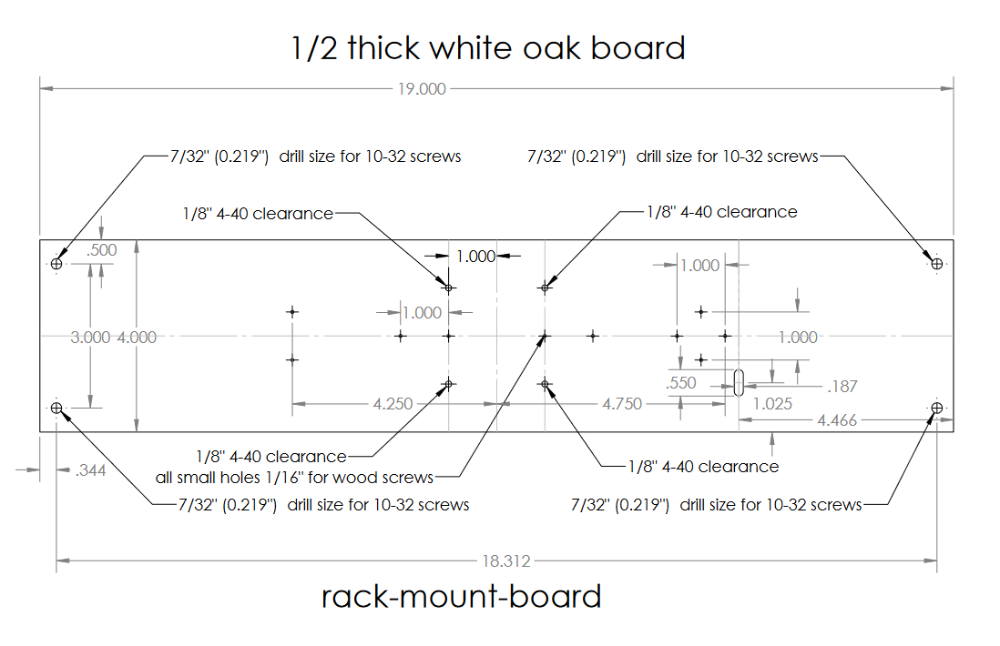
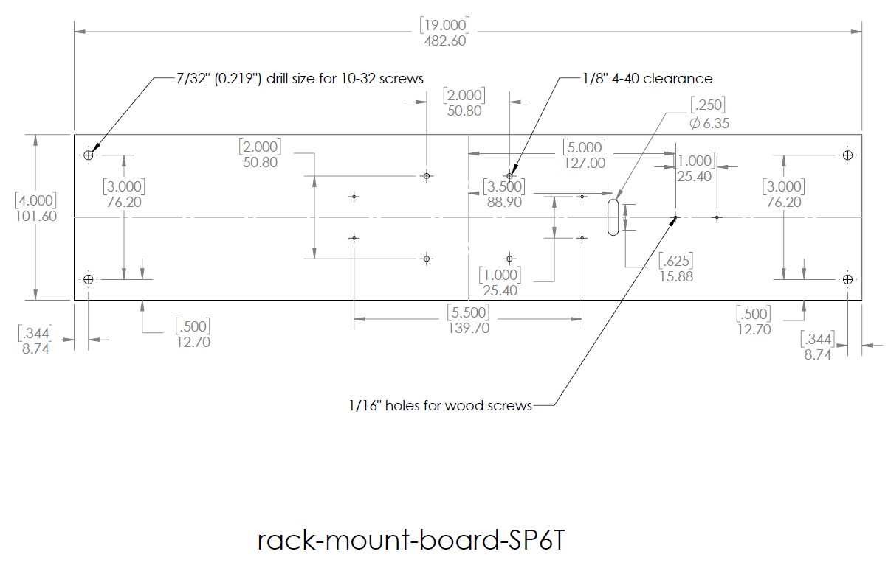
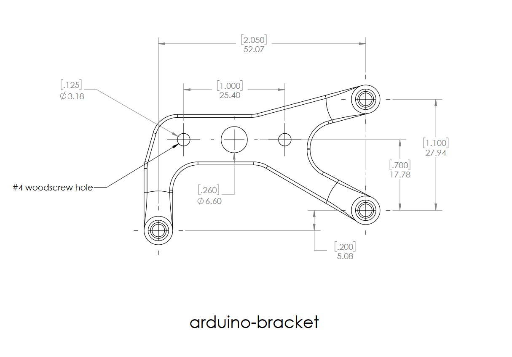
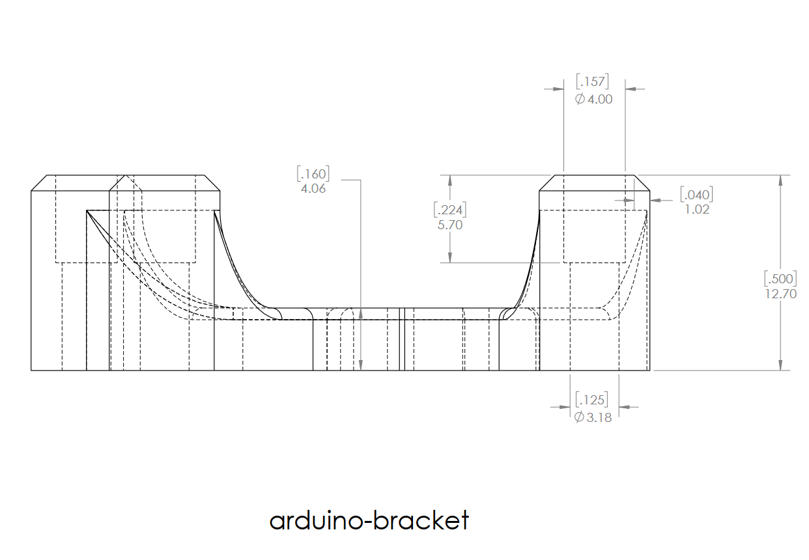
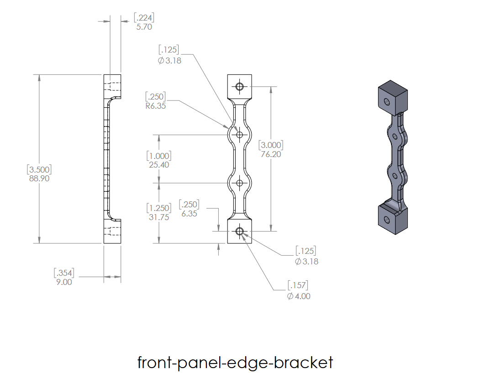

# [MEMSduino: Arduino-Based Controller for MEMS Switches](https://github.com/lafefspietz/MEMSduino/)

Open source system for controlling MEMS switches using an Arduino.  This system allows for both serial control via software and physical control by a human operator with buttons and indicator lights of a range of possible MEMS switch configurations.  A set of relays are controlled by the Arduino, which determines which of the lines on a DSUB connector are energized with a 90 volt signal.  This DSUB can then be connected to any cryogenic wiring which leads to the various DC control lines of a cryogenic MEMS RF switch.  

## [System Bill of Materials](BOM.xlsx)

System components:

 - [3dprint/](3dprint/)
 - [wood/](wood/)
 - [metalbox/](metalbox/)
 - [pcb/](pcb/)
 - [code/](code/)

## Disclaimer

Certain equipment, instruments, software, or materials are identified in this document in order to specify the experimental procedure adequately.  Such identification is not intended to imply recommendation or endorsement of any product or service by NIST, nor is it intended to imply that the materials or equipment identified are necessarily the best available for the purpose.

## MEMSduino Six Port COTS Commercial BOM

 - 4-40 brass thread inserts
 - BUD box
 - long 4-40 brass hex head screws
 - short 4-40 steel phillips screws

## MEMSduino Six Port COTS Build Sequence

 1. 

## MEMSduino Build Sequence

1. Cut wood board and drill holes in it
2. Cut out holes and D Sub Cutout in BUD box, mount DSUB into D cutout with 4-40 standoffs, mount to wood with long 4-40 screws
3. 3d print all 3d printed parts and add heat-pressed thread inserts
4. Screw all brackets to the wood board except for the HV-DCDC-bracket.STL, which is screwed to the inside of the BUD box.
5. Assemble Arduino UNO Shield board (arduino-to-headers-shield)
6. Mount the Arduino UNO to the 3d printed Arduino mounting bracket with 4-40 screws and plug the shield into the UNO
6. Assemble Relay control board (DB25-relay-HV-control), solder to captive DSUB connector in the lid of BUD box
7. Assemble the DC DC converter as needed to get to 90 volts or install an off the shelf converter in the BUD box, mount the board to the board mount bracket.
8. Assemble front panel control circuit board, mount it to the plastic brackets on the wood board
9. Connect all the cables, test system

# Wood Files

 - [.pdf for Rack Mount Wood Board](https://github.com/lafefspietz/MEMSduino/raw/refs/heads/main/wood/rack-mount-board.pdf)
 - [SolidWorks Drawing File for Rack Mount Wood Board](https://github.com/lafefspietz/MEMSduino/raw/refs/heads/main/wood/rack-mount-board.SLDDRW)
 - [SolidWorks Part File for Rack Mount Wood Board](https://github.com/lafefspietz/MEMSduino/raw/refs/heads/main/wood/rack-mount-board.SLDPRT)
 - [.pdf for Rack Mount Wood Board for SP6T](https://github.com/lafefspietz/MEMSduino/raw/refs/heads/main/wood/rack-mount-board-SP6T.pdf)
 - [SolidWorks Drawing File for Rack Mount Wood Board](https://github.com/lafefspietz/MEMSduino/raw/refs/heads/main/wood/rack-mount-board-SP6T.SLDDRW)
 - [SolidWorks Part File for Rack Mount Wood Board](https://github.com/lafefspietz/MEMSduino/raw/refs/heads/main/wood/rack-mount-board-SP6T.SLDPRT)

# Wood Drawings

# Wood Assembly Instructions

 1. Purchase [4"x24"x1/2" white oak boards](https://ocoochhardwoods.com/detail/?i=124wo)($5.40)
 2. Cut down to 19 inches long
 3. Print out second page of [.pdf for Rack Mount Wood Board for SP6T](wood/rack-mount-board-SP6T.pdf) for SP6T or [.pdf for Rack Mount Wood Board](wood/rack-mount-board.pdf) for SP9T, cut out along solid lines, and tape together along center dotted line
 4. Use cut out template to punch locations of all holes through the paper into the wood
 5. Drill out all the holes, and drill multiple holes and then rotate the drill around to cut out the elongated slot 
 6. Check alignment of holes and drill out larger any holes which are slightly off

# Diecast Aluminum Enclosure Machining Files

 - [.pdf Drawing for Box](https://github.com/lafefspietz/MEMSduino/raw/refs/heads/main/machining/AN-1304-A-box-modifications.pdf)
 - [SolidWorks part file for Box](https://github.com/lafefspietz/MEMSduino/raw/refs/heads/main/machining/AN-1304-A-box-modifications.SLDPRT)
 - [SolidWorks drawing file for Box](https://github.com/lafefspietz/MEMSduino/raw/refs/heads/main/machining/AN-1304-A-box-modifications.SLDDRW)
 - [STEP file for Box](https://github.com/lafefspietz/MEMSduino/raw/refs/heads/main/machining/AN-1304-A-box-modifications.STEP)
 - [.pdf Drawing for Lid](https://github.com/lafefspietz/MEMSduino/raw/refs/heads/main/machining/AN-1304-A-lid-modifications.pdf)
 - [SolidWorks part file for Lid](https://github.com/lafefspietz/MEMSduino/raw/refs/heads/main/machining/AN-1304-A-lid-modifications.SLDPRT)
 - [SolidWorks drawing file for Lid](https://github.com/lafefspietz/MEMSduino/raw/refs/heads/main/machining/AN-1304-A-lid-modifications.SLDDRW)
 - [STEP file for Lid](https://github.com/lafefspietz/MEMSduino/raw/refs/heads/main/machining/AN-1304-A-lid-modifications.STEP)

# Diecast Aluminum Enclosure Assembly Instructions

 - Purchase [AN-1304-A](https://www.digikey.com/en/products/detail/bud-industries/AN-1304-A/5804538) box and lid ($14.90)
 - Either get it machined by a shop using the .pdf and STEP files to order or
 - Gather a 4-40 tap, #43 drill, 1/8" end mill, 3/8" end mill, center drill, and machine it all out yourself using the .pdf plans for the [box](machining/AN-1304-A-box-modifications.pdf) and [lid](machining/AN-1304-A-lid-modifications.pdf).
 - Purchase [4-40  3/16"  long hex standoffs](https://www.mcmaster.com/91075A462/)(2x3.16 = $6.32) and [DSUB connector](https://www.digikey.com/en/products/detail/assmann-wsw-components/A-DF-25-PP-Z/1241794)($1.17) and screw connector to lid using standoffs.

# Circuit Board Files

 - [9button-9neopixel Altium Schematic File](https://github.com/lafefspietz/MEMSduino/raw/refs/heads/main/pcb/9button-9neopixel.PcbDoc)
 - [9button-9neopixel Altium Pcb File](https://github.com/lafefspietz/MEMSduino/raw/refs/heads/main/pcb/9button-9neopixel.PcbDoc)
 - [9button-9neopixel Altium Project File](https://github.com/lafefspietz/MEMSduino/raw/refs/heads/main/pcb/9button-9neopixel.PrjPcb)
 - [9button-9neopixel .zip of Gerber files](https://github.com/lafefspietz/MEMSduino/raw/refs/heads/main/pcb/9button-9neopixel-gerbers.zip)
 - [8button-8neopixel Altium Schematic File](https://github.com/lafefspietz/MEMSduino/raw/refs/heads/main/pcb/8button-8neopixel.schDoc)
 - [8button-8neopixel Altium Pcb File](https://github.com/lafefspietz/MEMSduino/raw/refs/heads/main/pcb/8button-8neopixel.PcbDoc)
 - [8button-8neopixel Altium Project File](https://github.com/lafefspietz/MEMSduino/raw/refs/heads/main/pcb/8button-8neopixel.PrjPcb)
 - [8button-8neopixel .zip of Gerber files](https://github.com/lafefspietz/MEMSduino/raw/refs/heads/main/pcb/8button-8neopixel-gerbers.zip)
 - [6button-6neopixel Altium Schematic File](https://github.com/lafefspietz/MEMSduino/raw/refs/heads/main/pcb/6button-6neopixel.schDoc)
 - [6button-6neopixel Altium Pcb File](https://github.com/lafefspietz/MEMSduino/raw/refs/heads/main/pcb/6button-6neopixel.PcbDoc)
 - [6button-6neopixel Altium Project File](https://github.com/lafefspietz/MEMSduino/raw/refs/heads/main/pcb/6button-6neopixel.PrjPcb)
 - [6button-6neopixel .zip of Gerber files](https://github.com/lafefspietz/MEMSduino/raw/refs/heads/main/pcb/6button-6neopixel-gerbers.zip)
 - [6button-6neopixel.pdf](https://github.com/lafefspietz/MEMSduino/raw/refs/heads/main/pcb/6button-6neopixel.pdf)
 - [arduino-to-headers-shield Altium Schematic File](https://github.com/lafefspietz/MEMSduino/raw/refs/heads/main/pcb/arduino-to-headers-shield.schDoc)
 - [arduino-to-headers-shield Altium Project File](https://github.com/lafefspietz/MEMSduino/raw/refs/heads/main/pcb/arduino-to-headers-shield.PrjPcb)
 - [arduino-to-headers-shield Altium Pcb File ](https://github.com/lafefspietz/MEMSduino/raw/refs/heads/main/pcb/arduino-to-headers-shield.PcbDoc)
 - [arduino-to-headers-shield .zip of Gerber files](https://github.com/lafefspietz/MEMSduino/raw/refs/heads/main/pcb/arduino-to-headers-shield-gerbers.zip)
 - [DB25-relay-HV-control Altium Schematic File](https://github.com/lafefspietz/MEMSduino/raw/refs/heads/main/pcb/DB25-relay-HV-control.schDoc)
 - [DB25-relay-HV-control Altium Project File](https://github.com/lafefspietz/MEMSduino/raw/refs/heads/main/pcb/DB25-relay-HV-control.PrjPcb)
 - [DB25-relay-HV-control Altium Pcb File](https://github.com/lafefspietz/MEMSduino/raw/refs/heads/main/pcb/DB25-relay-HV-control.PcbDoc)
 - [DB25-relay-HV-control .zip of Gerber files](https://github.com/lafefspietz/MEMSduino/raw/refs/heads/main/pcb/DB25-relay-HV-control-gerbers.zip)
 - [microd-header-adapter-board-rev2 Altium Schematic File](https://github.com/lafefspietz/MEMSduino/raw/refs/heads/main/pcb/microd-header-adapter-board-rev2.schDoc)
 - [microd-header-adapter-board-rev2 Altium Project File](https://github.com/lafefspietz/MEMSduino/raw/refs/heads/main/pcb/microd-header-adapter-board-rev2.PrjPcb)
 - [microd-header-adapter-board-rev2 Altium Pcb File](https://github.com/lafefspietz/MEMSduino/raw/refs/heads/main/pcb/microd-header-adapter-board-rev2.PcbDoc)
 - [microd-header-adapter-board-rev2 .zip of Gerber files](https://github.com/lafefspietz/MEMSduino/raw/refs/heads/main/pcb/microd-header-adapter-board-rev2-gerbers.zip)
 - [rectangle11board Altium Schematic File](https://github.com/lafefspietz/MEMSduino/raw/refs/heads/main/pcb/rectangle11board.schDoc)
 - [rectangle11board Altium Project File](https://github.com/lafefspietz/MEMSduino/raw/refs/heads/main/pcb/rectangle11board.PrjPcb)
 - [rectangle11board Altium Pcb File](https://github.com/lafefspietz/MEMSduino/raw/refs/heads/main/pcb/rectangle11board.PcbDoc)
 - [rectangle11board .zip of Gerber files](https://github.com/lafefspietz/MEMSduino/raw/refs/heads/main/pcb/rectangle11board.zip)
 - [cal-boards-panelization1 Bill of Materials](https://github.com/lafefspietz/MEMSduino/raw/refs/heads/main/pcb/cal-boards-panelization1-BOM.xlsx)
 - [cal-boards-panelization1 Altium Pcb File](https://github.com/lafefspietz/MEMSduino/raw/refs/heads/main/pcb/cal-boards-panelization1.PcbDoc)
 - [cal-boards-panelization1 .zip of Gerber files](https://github.com/lafefspietz/MEMSduino/raw/refs/heads/main/pcb/cal-boards-panelization1-gerbers.zip)
 - [cal-boards-zip.zip](https://github.com/lafefspietz/MEMSduino/raw/refs/heads/main/pcb/cal-boards-zip.zip)
 - [SchlibLafe.SchLib Library File](https://github.com/lafefspietz/MEMSduino/raw/refs/heads/main/pcb/SchlibLafe.SchLib)
 - [PcbLibLafe.PcbLib Library File](https://github.com/lafefspietz/MEMSduino/raw/refs/heads/main/pcb/PcbLibLafe.PcbLib)
 - [Fiducial.SchLib Library File](https://github.com/lafefspietz/MEMSduino/raw/refs/heads/main/pcb/Fiducial.SchLib)
 - [Fiducial.PcbLib Library File](https://github.com/lafefspietz/MEMSduino/raw/refs/heads/main/pcb/Fiducial.PcbLib)
 - [pogo_socket_2port.PcbDoc](https://github.com/lafefspietz/MEMSduino/raw/refs/heads/main/pcb/pogo_socket_2port.PcbDoc)
 - [pogo_socket_6port.PcbDoc](https://github.com/lafefspietz/MEMSduino/raw/refs/heads/main/pcb/pogo_socket_6port.PcbDoc)
 - [cal-boards-zip.zip](https://github.com/lafefspietz/MEMSduino/raw/refs/heads/main/pcb/cal-boards-zip.zip)
 - [SP8T_ecal.PcbDoc](https://github.com/lafefspietz/MEMSduino/raw/refs/heads/main/pcb/SP8T_ecal.PcbDoc)
 - [SP8T_ecal.PrjPcb](https://github.com/lafefspietz/MEMSduino/raw/refs/heads/main/pcb/SP8T_ecal.PrjPcb)
 - [SP8T_ecal.PrjPcbStructure](https://github.com/lafefspietz/MEMSduino/raw/refs/heads/main/pcb/SP8T_ecal.PrjPcbStructure)
 - [SP8T_ecal.SchDoc_1](https://github.com/lafefspietz/MEMSduino/raw/refs/heads/main/pcb/SP8T_ecal_1.SchDoc)
 - [SP8T_ecal.SchDoc_2](https://github.com/lafefspietz/MEMSduino/raw/refs/heads/main/pcb/SP8T_ecal_2.SchDoc)
 - [SP8T_ecal.SchDoc_3](https://github.com/lafefspietz/MEMSduino/raw/refs/heads/main/pcb/SP8T_ecal_3.SchDoc)
 - [SP8T_ecal_BOM.xlsx](https://github.com/lafefspietz/MEMSduino/raw/refs/heads/main/pcb/SP8T_ecal_BOM.xlsx)

# Circuit Board Drawings

# 3d Print Files

 - [front-panel-edge-bracket.STL](https://github.com/lafefspietz/MEMSduino/raw/refs/heads/main/3dprint/front-panel-edge-bracket.STL)
 - [front-panel-center-bracket.STL](https://github.com/lafefspietz/MEMSduino/raw/refs/heads/main/3dprint/front-panel-center-bracket.STL)
 - [arduino-bracket.STL](https://github.com/lafefspietz/MEMSduino/raw/refs/heads/main/3dprint/arduino-bracket.STL)
 - [HV-DCDC-bracket.STL](https://github.com/lafefspietz/MEMSduino/raw/refs/heads/main/3dprint/HV-DCDC-bracket.STL) 
 - [arduino-bracket.SLDPRT](https://github.com/lafefspietz/MEMSduino/raw/refs/heads/main/3dprint/arduino-bracket.SLDPRT)
 - [front-panel-center-bracket.SLDPRT](https://github.com/lafefspietz/MEMSduino/raw/refs/heads/main/3dprint/front-panel-center-bracket.SLDPRT)
 - [arduino-bracket.SLDPRT](https://github.com/lafefspietz/MEMSduino/raw/refs/heads/main/3dprint/arduino-bracket.SLDPRT)
 - [HV-DCDC-bracket.SLDPRT](https://github.com/lafefspietz/MEMSduino/raw/refs/heads/main/3dprint/HV-DCDC-bracket.SLDPRT) 

# 3d Print drawings

# Machining Files

 - [.pdf Drawing for Outer Block](https://github.com/lafefspietz/MEMSduino/raw/refs/heads/main/machining/outer-block.pdf)
 - [outer-block.SLDDRW](https://github.com/lafefspietz/MEMSduino/raw/refs/heads/main/machining/outer-block.SLDDRW)
 - [outer-block.SLDPRT](https://github.com/lafefspietz/MEMSduino/raw/refs/heads/main/machining/outer-block.SLDPRT)
 - [.pdf Drawing for Center Block](https://github.com/lafefspietz/MEMSduino/raw/refs/heads/main/machining/center-block.pdf)
 - [SolidWorks Drawing for Center Block](https://github.com/lafefspietz/MEMSduino/raw/refs/heads/main/machining/center-block.SLDDRW)
 - [SolidWorks Part File for Center Block](https://github.com/lafefspietz/MEMSduino/raw/refs/heads/main/machining/center-block.SLDPRT)
 - [.pdf Drawing of H Bracket](https://github.com/lafefspietz/MEMSduino/raw/refs/heads/main/machining/H-Bracket.pdf)
 - [SolidWorks Drawing for H Bracket](https://github.com/lafefspietz/MEMSduino/raw/refs/heads/main/machining/H-Bracket.SLDDRW)
 - [SolidWorks Part File for H Bracket](https://github.com/lafefspietz/MEMSduino/raw/refs/heads/main/machining/H-Bracket.SLDPRT)
 - [.pdf Drawing for T stand](https://github.com/lafefspietz/MEMSduino/raw/refs/heads/main/machining/T-stand.pdf)
 - [SolidWorks Drawing File for T stand](https://github.com/lafefspietz/MEMSduino/raw/refs/heads/main/machining/T-stand.SLDDRW)
 - [SolidWorks Part File for T Stand](https://github.com/lafefspietz/MEMSduino/raw/refs/heads/main/machining/T-stand.SLDPRT)

# Machining Drawings

# Arduino Code

 - [arduino/9-port-controller.ino](https://github.com/lafefspietz/MEMSduino/raw/refs/heads/main/arduino/9-port-controller/9-port-controller.ino)
 - [arduino/8_port_ecal_controller.ino](https://github.com/lafefspietz/MEMSduino/raw/refs/heads/main/arduino/8_port_ecal_controller/8_port_ecal_controller.ino)
 - [arduino/6_port_controller.ino](https://github.com/lafefspietz/MEMSduino/raw/refs/heads/main/arduino/6_port_controller/6_port_controller.ino)

# Matlab Switch Control

 - [matlab/switch_control.m](https://github.com/lafefspietz/MEMSduino/raw/refs/heads/main/matlab/switch_control.m)

# Jupyter Notebook with Python Control

 - [jupyter/switch_control.ipynb](https://github.com/lafefspietz/MEMSduino/raw/refs/heads/main/jupyter/switch_control.ipynb)

## License

This data/work was created by employees of the National Institute of Standards and Technology (NIST), an agency of the Federal Government. Pursuant to title 17 United States Code Section 105, works of NIST employees are not subject to copyright protection in the United States.  This data/work may be subject to foreign copyright.

The data/work is provided by NIST as a public service and is expressly provided “AS IS.” NIST MAKES NO WARRANTY OF ANY KIND, EXPRESS, IMPLIED OR STATUTORY, INCLUDING, WITHOUT LIMITATION, THE IMPLIED WARRANTY OF MERCHANTABILITY, FITNESS FOR A PARTICULAR PURPOSE, NON-INFRINGEMENT AND DATA ACCURACY. NIST does not warrant or make any representations regarding the use of the data or the results thereof, including but not limited to the correctness, accuracy, reliability or usefulness of the data. NIST SHALL NOT BE LIABLE AND YOU HEREBY RELEASE NIST FROM LIABILITY FOR ANY INDIRECT, CONSEQUENTIAL, SPECIAL, OR INCIDENTAL DAMAGES (INCLUDING DAMAGES FOR LOSS OF BUSINESS PROFITS, BUSINESS INTERRUPTION, LOSS OF BUSINESS INFORMATION, AND THE LIKE), WHETHER ARISING IN TORT, CONTRACT, OR OTHERWISE, ARISING FROM OR RELATING TO THE DATA (OR THE USE OF OR INABILITY TO USE THIS DATA), EVEN IF NIST HAS BEEN ADVISED OF THE POSSIBILITY OF SUCH DAMAGES.

To the extent that NIST may hold copyright in countries other than the United States, you are hereby granted the non-exclusive irrevocable and unconditional right to print, publish, prepare derivative works and distribute the NIST data, in any medium, or authorize others to do so on your behalf, on a royalty-free basis throughout the world.

You may improve, modify, and create derivative works of the data or any portion of the data, and you may copy and distribute such modifications or works. Modified works should carry a notice stating that you changed the data and should note the date and nature of any such change. Please explicitly acknowledge the National Institute of Standards and Technology as the source of the data:  Data citation recommendations are provided at https://www.nist.gov/open/license.

Permission to use this data is contingent upon your acceptance of the terms of this agreement and upon your providing appropriate acknowledgments of NIST’s creation of the data/work.

