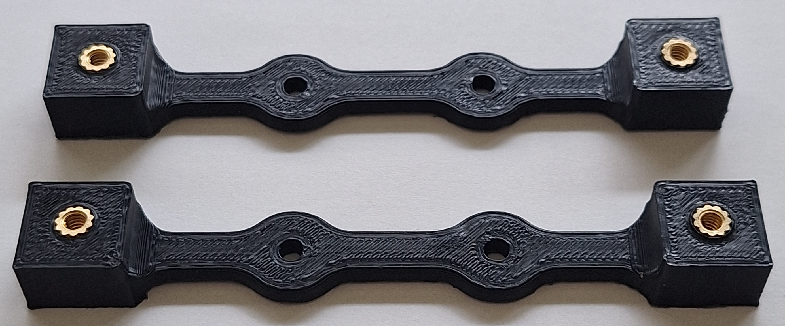

# [MEMSduino: Arduino-Based Controller for MEMS Switches](https://github.com/lafefspietz/MEMSduino/)

# Background

Measurement of microwave signals in the quantum regime is of increasing interest due the growth of superconducting quantum information technology, dark matter studies, and fundamental microwave quantum optics studies.  In order to observer microwaves in the quantum regime, the circuits being measured must be cooled to temperatures well below hf/k, where f is the frequency, h is the Planck constant, and k is the Boltzmann constant.  For the frequency range from 1 to 10 GHz typical in superconducting quantum information technology, if we want kT to be more than 10 times below hf, this means we need temperatures in the range from 0.005 to 0.05 kelvin.  This is generally accomplished with a dilution refrigerator, which uses the entropy of mixing of the two isotopes of liquid helium to cool large volumes(up to of order 1 cubic meter) of electronics down to approximately 0.01 kelvin.  

If we are to have a circuit thermalize to these low temperatures, we need to attenuate power going into the dilution refrigerator by several orders of magnitude.  In order to not overwhelm the extremely small quantum signals(<1 fW) with noise, these circuits generally also have cryogenic amplifiers inside the dilution refrigerator, which amplify the signal also by several orders of magnitude in power.  These amplifiers are expensive, bulky, and add to the heat load of the system. 

If researchers want to measure large numbers of samples in a single signal path, calibrate the noise, or calibrate the scattering parameters, they need to have the ability to switch a single signal line between a choice of multiple lines while the apparatus is cold.  At room temperature there are many solutions for this, but at low temperature the three known solutions are solenoid-based cryogenic electro-mechanical switches, piezo-based probe manipulators, and MEMS-based electro-mechanical switches.  The solenoid-based switches require large current pulses which heat up the whole cryostat, requiring on the order of an hour after each switching event. Also, they have been anecdotally and intermittently shown to destroy cryogenic HEMT amplifiers, which are several thousand dollars to replace, with potentially long lead times.  It is unknown at this time exactly what would be involved in preventing this from happening.  The piezo-based probe manipulators have been shown to be good for doing cryogenic on-wafer calibrations, but are slow and difficult to use, and are not compatible with many of the enclosures which are used in quantum information science experiments.  

This work concerns how to control the third of these solutions, the MEMS-based microwave switches from Menlo Microwave.  These switches have been shown to work at dilution refrigerator temperatures, and multiple commercial products exist today which are used for this.  Unlike the cryogenic solenoid-based switches, these switches are very compact, and are sold as a square surface mount package approximately 2.5mm on a side. These can be integrated into large and complex systems of interconnected circuit boards to make a wide range of possible experiments and products.  In order to control the RF lines of these switches, 90 volt DC signals are required.  In room temperature apparatus, this can be provided by built-in serial communication electronics. However, none of that CMOS-based electronics works at cryogenic temperatures.  

As companies create commercial products based on these MEMS switches, they can build custom controllers for any given switch design. However, in the current state of the field, there is considerable need for researchers to build new and ever-changing circuits using these switches, where rapid prototyping requires that they be able to control a variable number of 90 volt control lines.  Furthermore, it is useful in addition to being able to control these lines using software that a human operator be able to push buttons to change the state of the switch and see the current state in a clear and easy to understand display independent of any control computers.  

We present here an Arduino-based controller which allows experimenters to cheaply and easily control MEMS-based switches in a dilution refrigerator.  

# Elements

 - Control Panel PCB
 - BUD Box
 - Wood Rack Mount Board
 - 3d printed parts
 - Arduino shield board
 - DB 25 and relay breakout board
 - DC DC Converter to 90 volts
 - DB25 to Fischer cable
 - MicroD breakout board
 - Arduino Code
 - Python Control
 - Matlab Control

# Circuit Board Files

 - [PCB_files/Altium Schematic .SchDoc](9button-9neopixel.schDoc)
 - [PCB_files/Altium project file .PrjPcb](9button-9neopixel.PrjPcb)
 - [PCB_files/Altium Pcb File .PcbDoc](9button-9neopixel.PrjPcb)
 - [PCB_files/.zip of Gerber files](9button-9neopixel-gerbers.zip)
 - [Altium Schematic .SchDoc](PCB_files/arduino-to-headers-shield.schDoc)
 - [Altium project file .PrjPcb](PCB_files/arduino-to-headers-shield.PrjPcb)
 - [Altium Pcb File .PcbDoc](PCB_files/arduino-to-headers-shield.PcbDoc)
 - [.zip of Gerber files](PCB_files/arduino-to-headers-shield-gerbers.zip)
 - [Altium Schematic .SchDoc](PCB_files/DB25-relay-HV-control.schDoc)
 - [Altium project file .PrjPcb](PCB_files/DB25-relay-HV-control.PrjPcb)
 - [Altium Pcb File .PcbDoc](PCB_files/DB25-relay-HV-control.PcbDoc)
 - [.zip of Gerber files](PCB_files/DB25-relay-HV-control-gerbers.zip)
 - [Altium Schematic .SchDoc](PCB_files/DB25-relay-HV-control.schDoc)
 - [Altium project file .PrjPcb](PCB_files/DB25-relay-HV-control.PrjPcb)
 - [Altium Pcb File .PcbDoc](PCB_files/DB25-relay-HV-control.PcbDoc)
 - [.zip of Gerber files](PCB_files/DB25-relay-HV-control-gerbers.zip)

# 3d Print Files

 - [front-panel-edge-bracket.STL](3dprint_files/front-panel-edge-bracket.STL)
 - [front-panel-center-bracket.STL](3dprint_files/front-panel-center-bracket.STL)
 - [arduino-bracket.STL](3dprint_files/arduino-bracket.STL)
 - [HV-DCDC-bracket.STL](3dprint_files/HV-DCDC-bracket.STL) 
 - [arduino-bracket.SLDPRT](3dprint_files/arduino-bracket.SLDPRT)
 - [front-panel-center-bracket.SLDPRT](3dprint_files/front-panel-center-bracket.SLDPRT)
 - [arduino-bracket.SLDPRT](3dprint_files/arduino-bracket.SLDPRT)
 - [HV-DCDC-bracket.SLDPRT](3dprint_files/HV-DCDC-bracket.SLDPRT) 

# Machining Files

 - [.pdf drawing for Box](machining_files/AN-1304-A-lid-machined.pdf)
 - [SolidWorks part file for Box](machining_files/AN-1304-A-lid-machined.SLDPRT)
 - [SolidWorks drawing file for Box](machining_files/AN-1304-A-lid-machined.SLDDRW)
 - [STEP file for Box](machining_files/AN-1304-A-lid-machined.STEP)
 - [.pdf drawing file for lid](machining_files/AN-1304-A-machined-box.pdf)
 - [SolidWorks part file for lid](machining_files/AN-1304-A-machined-box.SLDPRT)
 - [SolidWorks drawing file for lid](machining_files/AN-1304-A-machined-box.SLDDRW)
 - [STEP file for lid](machining_files/AN-1304-A-machined-box.STEP)
 - [center-block-outside.pdf](machining_files/center-block-outside.pdf)
 - [center-block-outside.SLDDRW](machining_files/center-block-outside.SLDDRW)
 - [center-block-outside.SLDPRT](machining_files/center-block-outside.SLDPRT)
 - [center-block-v2.pdf](machining_files/center-block-v2.pdf)
 - [center-block-v2.SLDDRW](machining_files/center-block-v2.SLDDRW)
 - [center-block-v2.SLDPRT](machining_files/center-block-v2.SLDPRT)
 - [HBracket-M4.pdf](machining_files/HBracket-M4.pdf)
 - [HBracket-M4.SLDDRW](machining_files/HBracket-M4.SLDDRW)
 - [HBracket-M4.SLDPRT](machining_files/HBracket-M4.SLDPRT)
 - [standoff.pdf](machining_files/standoff.pdf)
 - [standoff.SLDDRW](machining_files/standoff.SLDDRW)
 - [standoff.SLDPRT](machining_files/standoff.SLDPRT)
 - [rack-mount-board.pdf](machining_files/rack-mount-board.pdf)
 - [rack-mount-board.SLDDRW](machining_files/rack-mount-board.SLDDRW)
 - [rack-mount-board.SLDPRT](machining_files/rack-mount-board.SLDPRT)

# Build Files

 - [builds/build-whole-system.pdf](builds/build-whole-system.pdf)
 - [builds/build-3dprinted-parts.pdf](builds/build-3dprinted-parts.pdf)
 - [builds/build-90V.pdf](builds/build-90V.pdf)
 - [builds/Arduino.pdf](builds/Arduino.pdf)
 - [builds/build-DB25-relay-HV-control.pdf](builds/build-DB25-relay-HV-control.pdf)
 - [builds/build-Front-Panel-Boards.pdf](builds/build-Front-Panel-Boards.pdf)
 - [builds/build-cold-board-mount-brackets.pdf](builds/build-cold-board-mount-brackets.pdf)
 - [builds/build-cold-microD-breakout.pdf](builds/build-cold-microD-breakout.pdf)
 - [builds/build-wood-board.pdf](builds/build-wood-board.pdf)
 - [builds/build-shield.pdf](builds/build-shield.pdf)
 - [builds/build-bud-box.pdf](builds/build-bud-box.pdf)
 - [builds/build-whole-system.pptx](builds/build-whole-system.pptx)
 - [builds/build-3dprinted-parts.pptx](builds/build-3dprinted-parts.pptx)
 - [builds/build-90V.docx](builds/build-90V.docx)
 - [builds/Arduino.pptx](builds/Arduino.pptx)
 - [builds/build-DB25-relay-HV-control.pptx](builds/build-DB25-relay-HV-control.pptx)
 - [builds/build-Front-Panel-Boards.pptx](builds/build-Front-Panel-Boards.pptx)
 - [builds/build-cold-board-mount-brackets.pptx](builds/build-cold-board-mount-brackets.pptx)
 - [builds/build-cold-microD-breakout.pptx](builds/build-cold-microD-breakout.pptx)
 - [builds/build-wood-board.pptx](builds/build-wood-board.pptx)
 - [builds/build-shield.pptx](builds/build-shield.pptx)
 - [builds/build-bud-box.pptx](builds/build-bud-box.pptx)

# Computer Files

 - [9-port-controller/9-port-controller.ino](9-port-controller/9-port-controller.ino)
 - [8_port_ecal_controller/8_port_ecal_controller.ino](8_port_ecal_controller/8_port_ecal_controller.ino)
 - [6_port_controller_NIST_detector/6_port_controller_NIST_detector.ino](6_port_controller_NIST_detector/6_port_controller_NIST_detector.ino)
 - [matlab/switch_control.m](matlab/switch_control.m)
 - [jupyter/switch_control.ipynb](jupyter/switch_control.ipynb)

# Control Panel PCB

This board both controls the state of the switches with a set of 9 buttons and indicates the current switch state with a set of 9 LED's.  

## Bill of Materials

 - [PCB's](https://www.pcbway.com)
 - [ Neopixels (9x)](https://www.adafruit.com/product/1559)
 - [10 k resistors (9x)](https://www.digikey.com/en/products/detail/yageo/MFR-25FBF52-10K/13219)
 - [4 pin header cable (1x)](https://www.amazon.com/ZYAMY-Dupont-Connector-Multicolor-Breadboard/dp/B0789F523N/)
 - [header strips (40 pins)](https://www.digikey.com/en/products/detail/amphenol-cs-commercial-products/G800W268018EU/17083164)
 - [buttons (9x)](https://www.digikey.com/en/products/detail/e-switch/TL59NF160Q/390533)

[Digkey Cart with everything but PCB's](https://www.digikey.com/short/jzc9cpp0)

## Files

 - [PCB_files/Altium Schematic .SchDoc](9button-9neopixel.schDoc)
 - [PCB_files/Altium project file .PrjPcb](9button-9neopixel.PrjPcb)
 - [PCB_files/Altium Pcb File .PcbDoc](9button-9neopixel.PrjPcb)
 - [PCB_files/.zip of Gerber files](9button-9neopixel-gerbers.zip)

# BUD Box

We use a diecast aluminum enclosure from [Bud Industries](https://www.budind.com/)(part number [AN-1304-A](https://www.budind.com/product/nema-ip-rated-boxes/an-a-series-style-a-aluminum-enclosure/an-1304/)) to enclose the high voltage driver for the MEMS switches used in the QNA system. 

This box can be modified yourself if you have access to a milling machine or you can get it modified by Bud or by some third party machine shop.  

 - [AN-1304-A Bud Box page at Bud Industries](https://www.budind.com/product/nema-ip-rated-boxes/an-a-series-style-a-aluminum-enclosure/an-1304/#group=series-products&external_dimensions_group=0&internal_dimensions=0&mounting_style_group=0)
 - [AN-1304 Bud Box at Digikey](https://www.digikey.com/en/products/detail/bud-industries/AN-1304-A/5804538)
 - [Standoffs from McMaster Carr, part number #91075A462](https://www.mcmaster.com/91075A462/)
 - [3/4" 4-40 brass screws from McMastrer Carr](https://www.mcmaster.com/93465A113/)
 - [#4 brass washers from McMastrer Carr](https://www.mcmaster.com/92916A320/)
 - [4-40 tap](https://www.mcmaster.com/25995A125/)
 - [tap wrench](https://www.mcmaster.com/25605A63/)
 - [#43 drill](https://www.mcmaster.com/3584A232)
 - [1/8" End Mill](https://www.mcmaster.com/3056A61/)
 - [.pdf drawing for Box](machining_files/AN-1304-A-lid-machined.pdf)
 - [SolidWorks part file for Box](machining_files/AN-1304-A-lid-machined.SLDPRT)
 - [SolidWorks drawing file for Box](machining_files/AN-1304-A-lid-machined.SLDDRW)
 - [STEP file for Box](machining_files/AN-1304-A-lid-machined.STEP)
 - [.pdf drawing file for lid](machining_files/AN-1304-A-machined-box.pdf)
 - [SolidWorks part file for lid](machining_files/AN-1304-A-machined-box.SLDPRT)
 - [SolidWorks drawing file for lid](machining_files/AN-1304-A-machined-box.SLDDRW)
 - [STEP file for lid](machining_files/AN-1304-A-machined-box.STEP)

# Wood Board

 - [Dimensioned drawing and templates rack-mount-board.pdf](rack-mount-board.pdf)
 - [Solidworks Drawing rack-mount-board.SLDDRW](rack-mount-board.SLDDRW)
 - [Solidworks part file for rack-mount-board.SLDPRT](rack-mount-board.SLDPRT)
 - [Link to buy board](https://ocoochhardwoods.com/detail/?i=124wo)
 - [Mouser link to buy nuts for rack](https://www.mouser.com/ProductDetail/Hammond-Manufacturing/1421NP25?qs=yc9RBI4tIALvGirsWAVfbg%3D%3D)
 - [Link to buy wood screws](https://www.mcmaster.com/98685A540/)
 - [Link to buy thumb screws](https://www.mcmaster.com/92421A645/)

We use white oak boards which can be purchased in convenient sizes and cut to fit a 19 inch rack.  

# 3d Printed Files

These 3d printed parts are used to attach the control panel circuit board to the wood rack mount panel, to attach the Arduino to the back of the same panel, and to mount the high voltage DC-DC converter to the inside of the Bud Box.

 1. [front-panel-edge-bracket.STL, print 2, add inserts](3dprint_files/front-panel-edge-bracket.STL)
 2. [front-panel-center-bracket.STL, print 2](3dprint_files/front-panel-center-bracket.STL)
 3. [arduino-bracket.STL, print 1, add inserts](3dprint_files/arduino-bracket.STL)
 4. [HV-DCDC-bracket.STL, print 1, add inserts](3dprint_files/HV-DCDC-bracket.STL) 

## Thread Inserts

## 4-40 Quarter Inch Screws

## #4 Wood Screws

[Mcmaster-Carr Part number 98685A540](https://www.mcmaster.com/98685A540/)

## Arduino Bracket

Print one of these per controller.  This works for both Arduino UNO and Arduino Mega. Screw into wood using #4 wood screws.  

Use 4-40 brass thread inserts, press them in with a soldering iron. 

 

 

## DC DC converter Bracket

Use 4-40 brass thread inserts, press them in with a soldering iron

 

## Front Panel Edge Bracket

Use 4-40 brass thread inserts, press them in with a soldering iron. Attach to wood with #4 wood screws. 

 

 

## Front Panel Center Bracket

place in center area of circuit board to prevent bowing, use #4 wood screws to mount.

 

 

## Assembly with Wood Board

## Arduino UNO Hole Pattern

# Arduino Shield Board

## Bill of Materials

 - [330 ohm resistors](https://www.digikey.com/en/products/detail/stackpole-electronics-inc/CF18JT330R/1741683)
 - [100k resistors](https://www.digikey.com/en/products/detail/stackpole-electronics-inc/RNF14FTD100K/1706591)
 - [1000 uF Capacitors](https://www.digikey.com/en/products/detail/rubycon/16PK1000MEFC10X12-5/3563556)
 - [header strips (40 pins)](https://www.digikey.com/en/products/detail/amphenol-cs-commercial-products/G800W268018EU/17083164)

## Files

 - [Altium Schematic .SchDoc](PCB_files/arduino-to-headers-shield.schDoc)
 - [Altium project file .PrjPcb](PCB_files/arduino-to-headers-shield.PrjPcb)
 - [Altium Pcb File .PcbDoc](PCB_files/arduino-to-headers-shield.PcbDoc)
 - [.zip of Gerber files](PCB_files/arduino-to-headers-shield-gerbers.zip)

# DB25 Relay Board

## Bill of Materials

 - [1 MOhm 1206 SMT resistors](https://www.digikey.com/en/products/detail/yageo/RC1206FR-071ML/728388)
 - [DB25 board mount connector](https://www.digikey.com/en/products/detail/assmann-wsw-components/A-DF-25-PP-Z/1241794)
 - [Comus 3570-1331-053 Relays](https://www.digikey.com/en/products/detail/comus-international/3570-1331-053/7497099)
 - [header strips (40 pins)](https://www.digikey.com/en/products/detail/amphenol-cs-commercial-products/G800W268018EU/17083164)

## Files

 - [Altium Schematic .SchDoc](PCB_files/DB25-relay-HV-control.schDoc)
 - [Altium project file .PrjPcb](PCB_files/DB25-relay-HV-control.PrjPcb)
 - [Altium Pcb File .PcbDoc](PCB_files/DB25-relay-HV-control.PcbDoc)
 - [.zip of Gerber files](PCB_files/DB25-relay-HV-control-gerbers.zip)

# 0.1 Inch Header Cables

 - [2 wire](https://www.amazon.com/ZYAMY-Dupont-Connector-Multicolor-Breadboard/dp/B0B8Z23NWX/)
 - [4 wire](https://www.amazon.com/ZYAMY-Dupont-Connector-Multicolor-Breadboard/dp/B0789F523N/)
 - [8 wire](https://www.amazon.com/ZYAMY-Dupont-Connector-Multicolor-Breadboard/dp/B0789F2Y1T/)

# 90 Volt Power Supply

We use the 5 volt regulated supply on the Arduino UNO as a source for a pair of DC-DC converters. A pair of header pins on the [Arduino Uno Shield Board](../arduino_shield_pcb/) connect to a 2 wire cable which joins a 2 pin socket connector to the first DC-DC converter(5 volts to 12 volts), which in turn connects to the high voltage adjustable DC-DC converter which converts from 12 volts up to 90 volts.  This 90 volt signal connects to the [DB25 Relay Circuit Board](../DB25_relay_pcb/) via the other half of a split 2 wire connector.  

## [2 Wire Cable from Amazon](https://www.amazon.com/ZYAMY-Dupont-Connector-Multicolor-Breadboard/dp/B0B8Z23NWX/)

## [5 V to 12 V boost from Amazon]((https://www.amazon.com/DROK-Boost-Converter-Regulator-Length/dp/B09M3LMSS3/))

## [12 V to variable HV Boost board from Amazon](https://www.amazon.com/Voltage-Converter-Vintage-Indicator-80V-380V/dp/B09D93QNYK)

# Arduino Code

 - [9-port-controller/9-port-controller.ino](9-port-controller/9-port-controller.ino)
 - [8_port_ecal_controller/8_port_ecal_controller.ino](8_port_ecal_controller/8_port_ecal_controller.ino)
 - [6_port_controller_NIST_detector/6_port_controller_NIST_detector.ino](6_port_controller_NIST_detector/6_port_controller_NIST_detector.ino)

# Matlab Code

 - [matlab/switch_control.m](matlab/switch_control.m)

# Python Code

 - [jupyter/switch_control.ipynb](jupyter/switch_control.ipynb)

# Total Bill of Materials

 - [$16.90 1 Arduino UNO](https://www.digikey.com/en/products/detail/dfrobot/DFR0216/6579366)
 - 9 Single Neopixel boards
 - 9 Buttons
 - 1 4"x24"x1/2" white oak board
 - 4 knurled thumb screws
 - wood screws
 - 4-40 Phillips screws
 - 4-40 cap screws(various sizes)
 - 3d printed arduino mounting bracket
 - 3d printed DC-DC converter mounting bracket
 - 3d printed edge bracket for front panel pcb
 - 3d printed middle bracket for front panel pcb
 - Brass thread inserts
 - front panel pcb
 - arduino shield board
 - DB 25 relay board
 - DC Micro-D breakout board
 - RF switch board
 - RF calibration board panel
 - Bud Box
 - DB25 to Fischer connector cable
 - Machined brass H bracket to mount to fridge mixing chamber plate
 - Machined brass H bracket standoff
 - Machined brass center block outside
 - Machined brass center block
 - hex standoffs
 - 5 volt to 12 volt DC DC converter
 - 12 volt to variable high voltage DC DC converter
 - 2 wire cables
 - 4 wire cables
 - 8 wire cables
 - DB25 connector
 - relays
 - 330 ohm resistors
 - 10 k resistors
 - 100 k resistors
 - 1 M resistors
 - 0.1" headers
 - Micro-D board mont connectors
 - 75 k resistors
 - 90 degree limited detent SMP
 - Straight smooth bore SMP
 - SMP barrels

# Build Instructions

1. Cut the wood board and drill out the holes in it
2. Machine out the Bud box if you are not getting that done by a shop
3. Print the 3d printed parts and add thread inserts
4. Assemble shield board
5. Assemble DC DC converter System, set the voltage with the potentiometer and test
6. Assemble DB25 relay board other than the DB25 connector
7. Put the DB25 connector into the lid, add insulating tape to the lid, and finish the assembly
8. Finish the whole assembly of the BUD box, the Front Panel board, the Arduino mount, Arduino, Arduino shield, and cables
9. Connect Arduino UNO, program it, and test it
10. Assemble the DC cold control board
11. Machine the brass parts for the cryogenic assembly
11. Assemble the assembly

