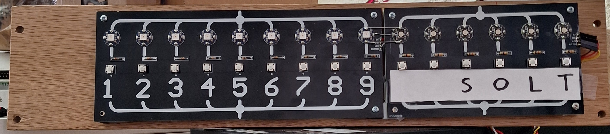
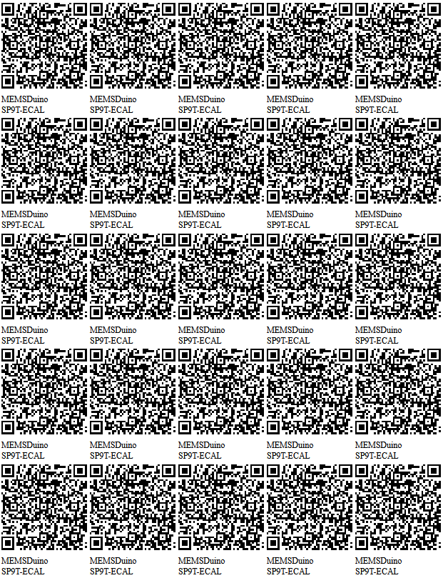

# [SP9T SP4T ECAL](https://github.com/lafefspietz/MEMSduino/tree/main/SP9T-ECAL)

## [SP9T-ECAL.ino](https://github.com/lafefspietz/MEMSduino/blob/main/SP9T-ECAL/arduino/SP9T-ECAL/SP9T-ECAL.ino)

## [SP9T-ECAL.ino](https://github.com/lafefspietz/MEMSduino/blob/main/SP9T-ECAL/arduino/SP9T-ECAL/SP9T-ECAL.ino)

