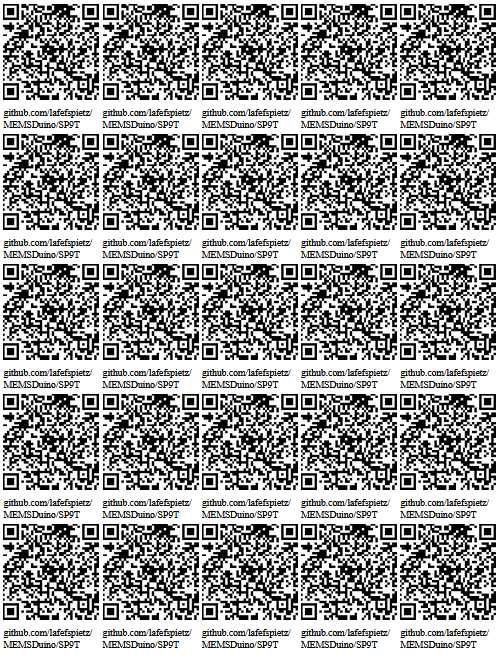
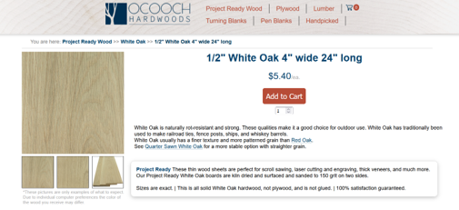
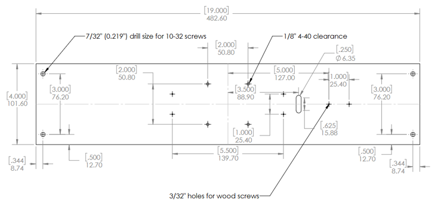
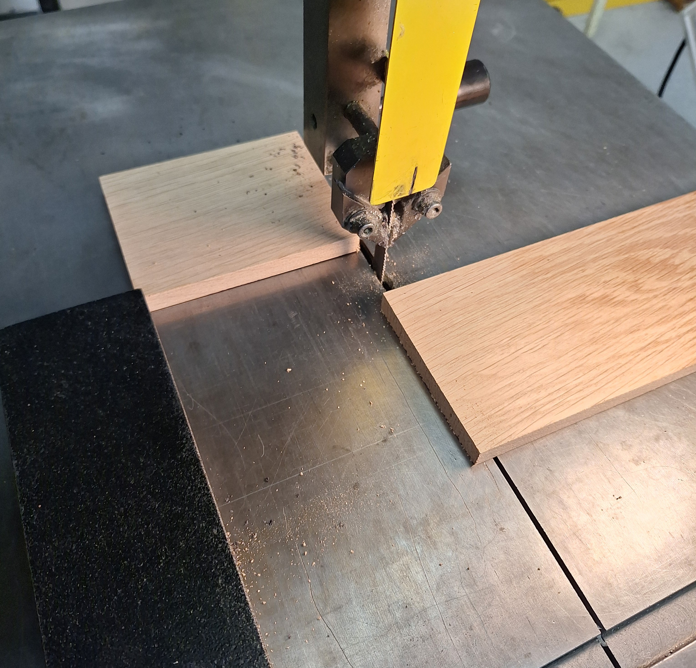
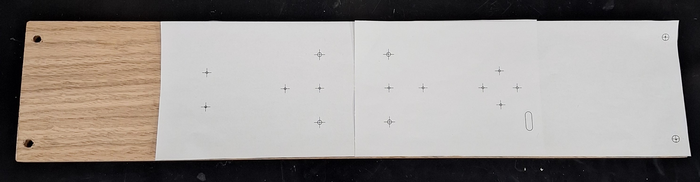
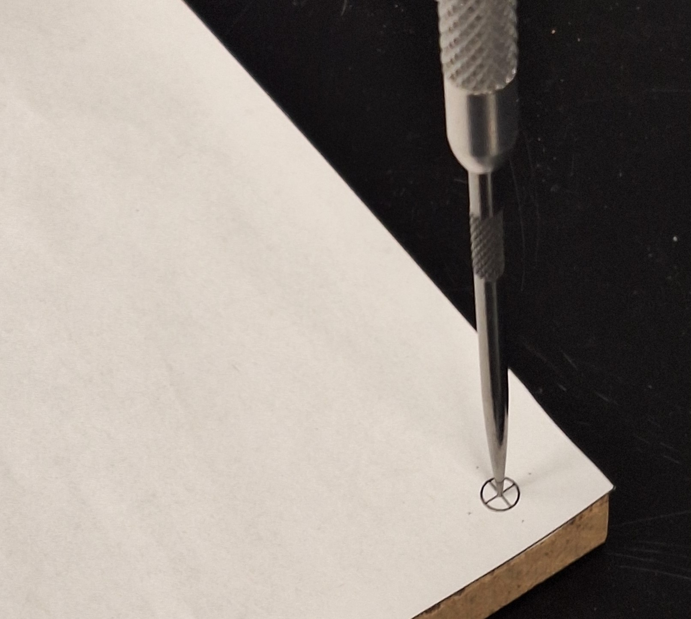
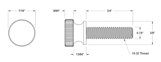
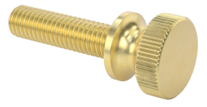
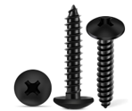

# [SP9T](https://github.com/lafefspietz/MEMSduino/tree/main/SP9T)

# WOOD BOARD

# Bill of Materials

# Illustrated and Anotated Bill of Materials

# Metal Box

# DC DC conversion

# Relay

# 3d Printed Parts

# Build Instructions