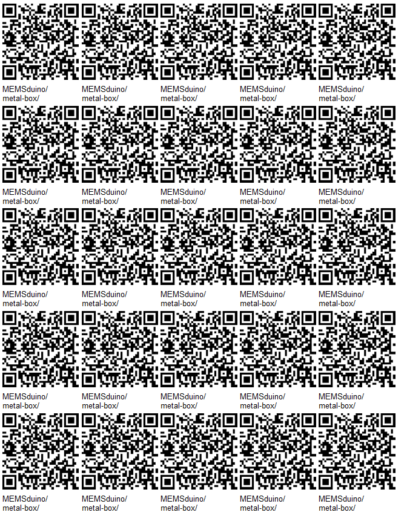
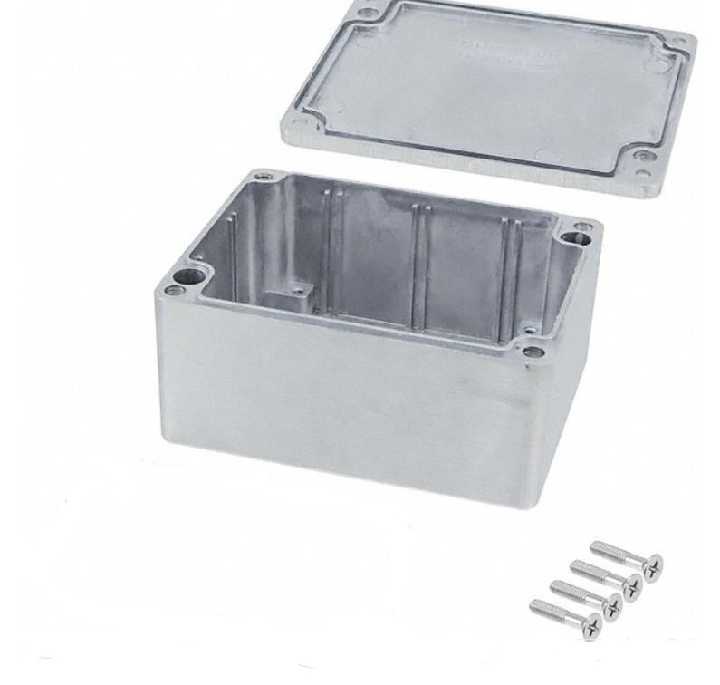
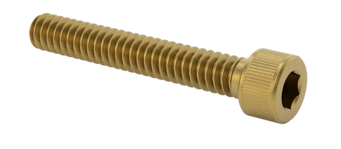
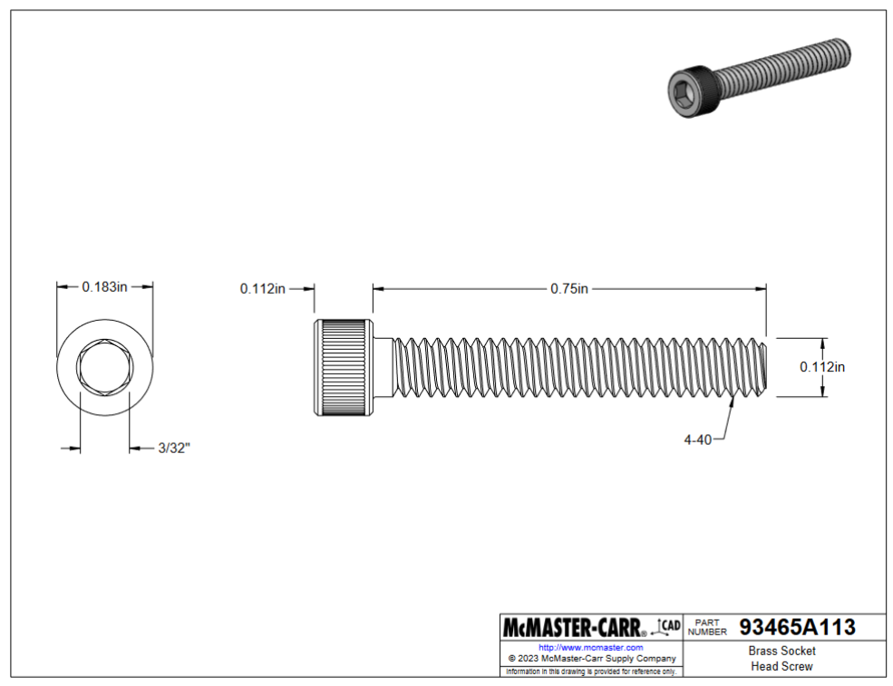
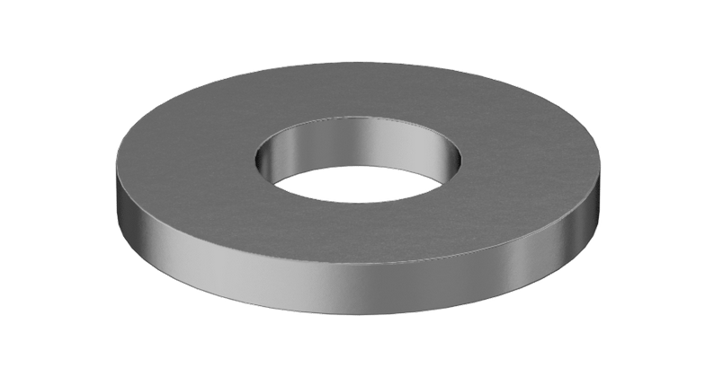
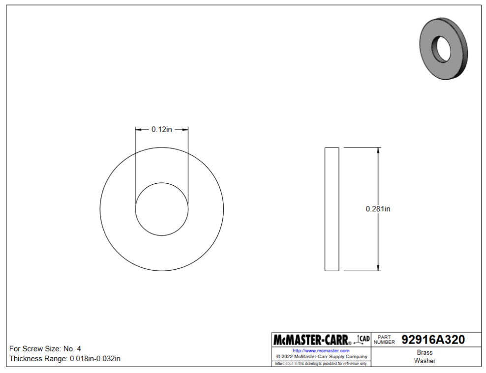
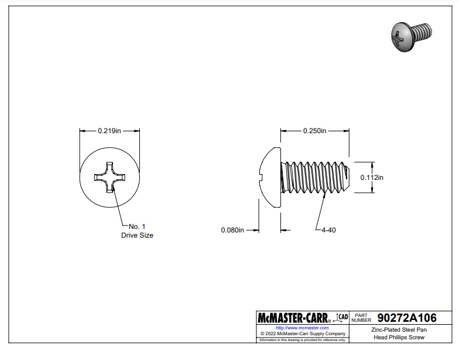

# [Metal Box](https://github.com/lafefspietz/MEMSduino/tree/main/metal-box)

Machined modifications to off the shelf diecast aluminum enclosure, AN-1304-A box from Bud Industries.

## PICTORIAL BILL OF MATERIALS

### Bud Industries AN-1304-A

### 3/4" long 4-40 Brass socket cap screws

[McMaster Carr Part number 93465A113](https://www.mcmaster.com/93465A113/) are screws used to attach the metal box to the 1/2 thick wood board. Use with a #4 washer.

### #4 Brass Washer

[McMaster Carr part number 92916A320](https://www.mcmaster.com/92916A320/). Used with the 3/4" 4-40 brass screws to attach metal box to 1/2" wood board.

### 1/4" long 4-40 

These screws are used to attach various brackets to the inside of the box.  Make your brackets 3 mm thick, with a clearance hole for #4 screws, about 0.125" diameter.  These are [McMaster Carr Part number 90272A106](https://www.mcmaster.com/90272A106/).

### 3/16" long 4-40 hex standoffs

[McMaster Carr Part number 91075A462](https://www.mcmaster.com/91075A462/)

