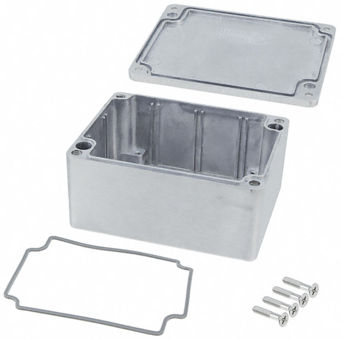
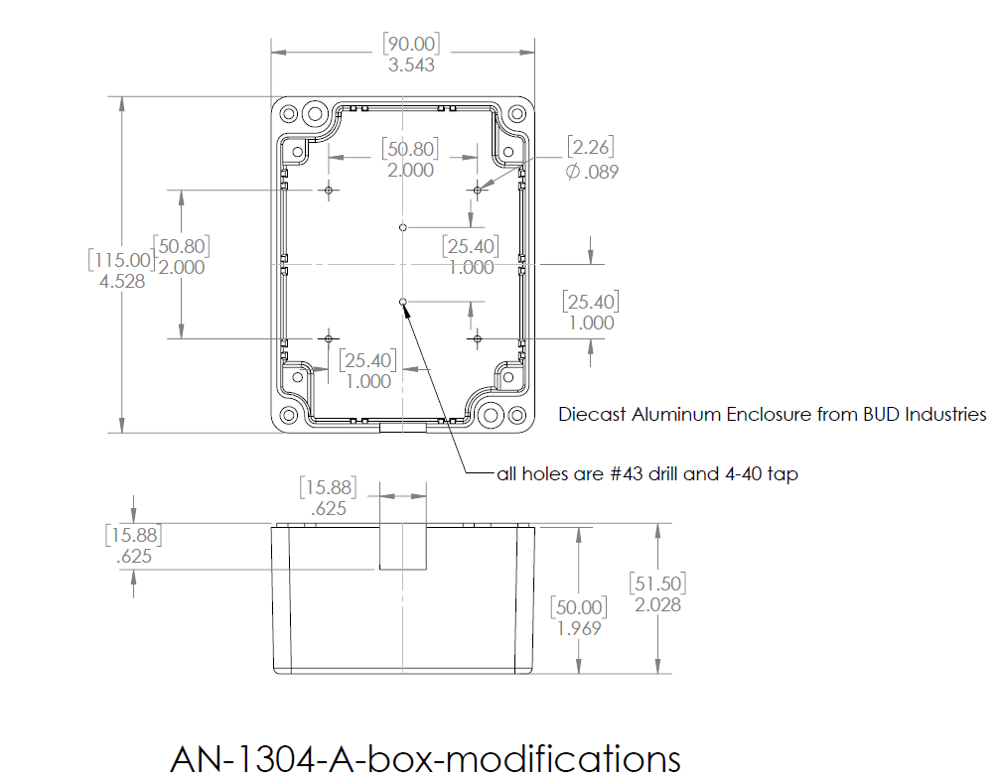
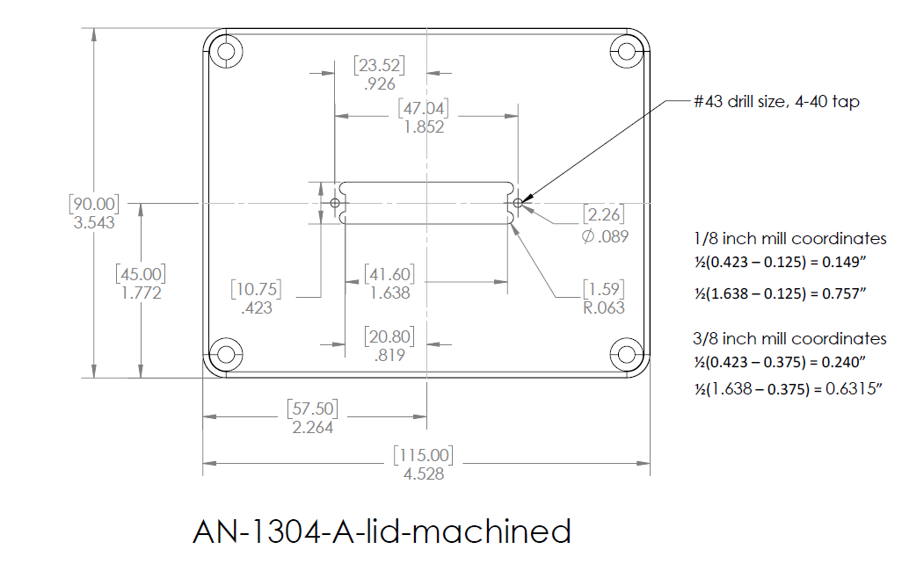
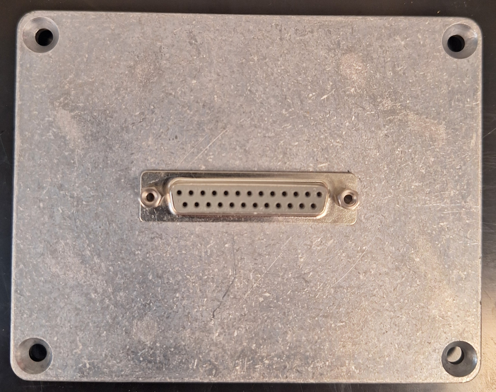
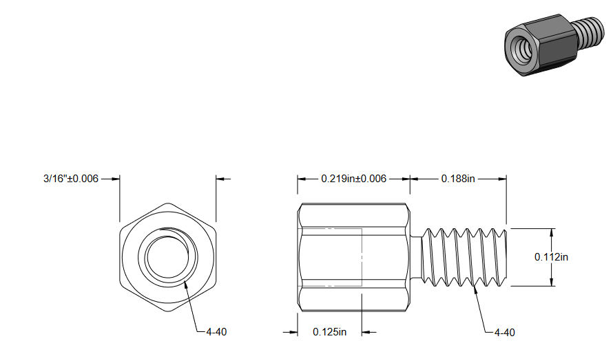

## [../](../)

# MEMSDuino Metal Box Files

## [files.html](files.html)

## [webeditor.html](webeditor.html)

This part is the same for both builds. You will need a milling machine and some machine tools or to find a shop who can do the modifications.  In the latter case, you will need to send the machine shop the .pdf drawings and the .STEP files.

## All Files

 - [MEMSduino-metalbox.zip (all files)](MEMSduino-metalbox.zip)
 - [AN-1304-A-box-modifications.SLDDRW](AN-1304-A-box-modifications.SLDDRW)
 - [AN-1304-A-box-modifications.SLDPRT](AN-1304-A-box-modifications.SLDPRT)
 - [AN-1304-A-box-modifications.STEP](AN-1304-A-box-modifications.STEP)
 - [AN-1304-A-box-modifications.pdf](AN-1304-A-box-modifications.pdf)
 - [AN-1304-A-lid-modifications.SLDDRW](AN-1304-A-lid-modifications.SLDDRW)
 - [AN-1304-A-lid-modifications.SLDPRT](AN-1304-A-lid-modifications.SLDPRT)
 - [AN-1304-A-lid-modifications.STEP](AN-1304-A-lid-modifications.STEP)
 - [AN-1304-A-lid-modifications.pdf](AN-1304-A-lid-modifications.pdf)

## Parts and Tools needed

 - AN-1304-A diecast aluminum box from Bud Industries
 - Milling machine 
 - 1/8" end mill
 - 3/8" end mill
 - Center drill
 - Edge finder
 - 3/16" long 4-40 standoffs
 - #43 drill
 - 4-40 tap, tapping tool, cutting oil
 - 0.75" long 4-40 brass socket cap screw
 - Either a DSUB board mount connector(for SP9T) or a DSUB solder cup connector(for COTS SP6T) depending on which build

