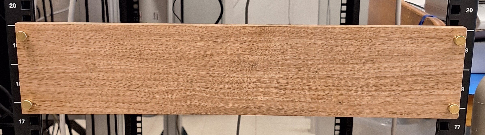
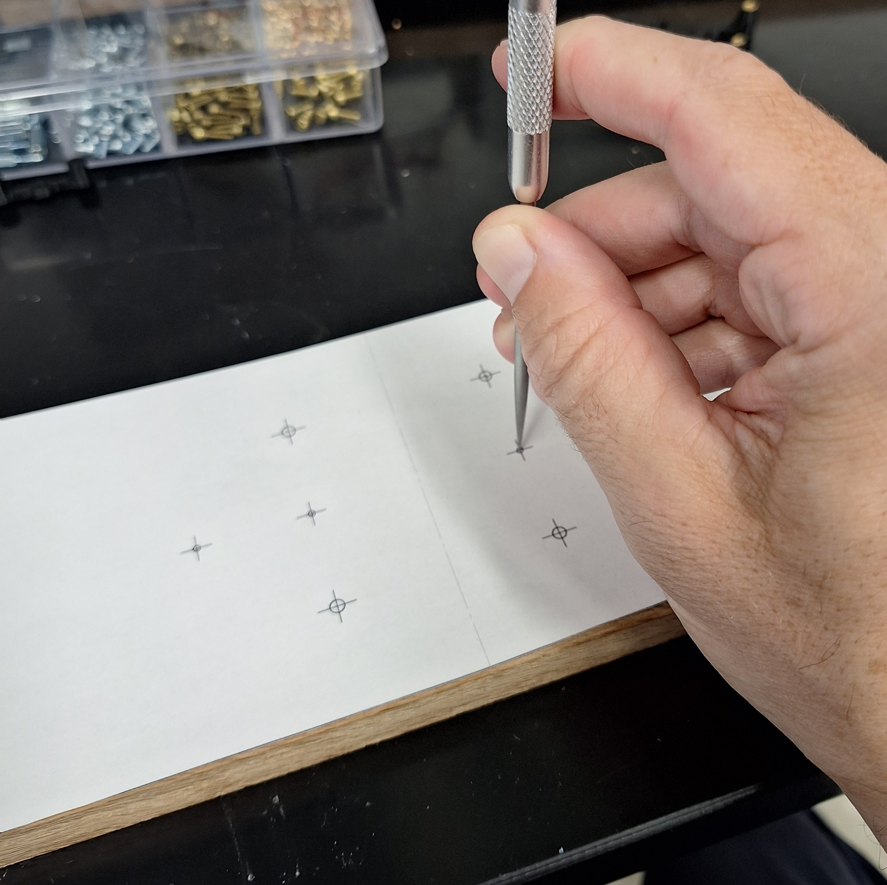
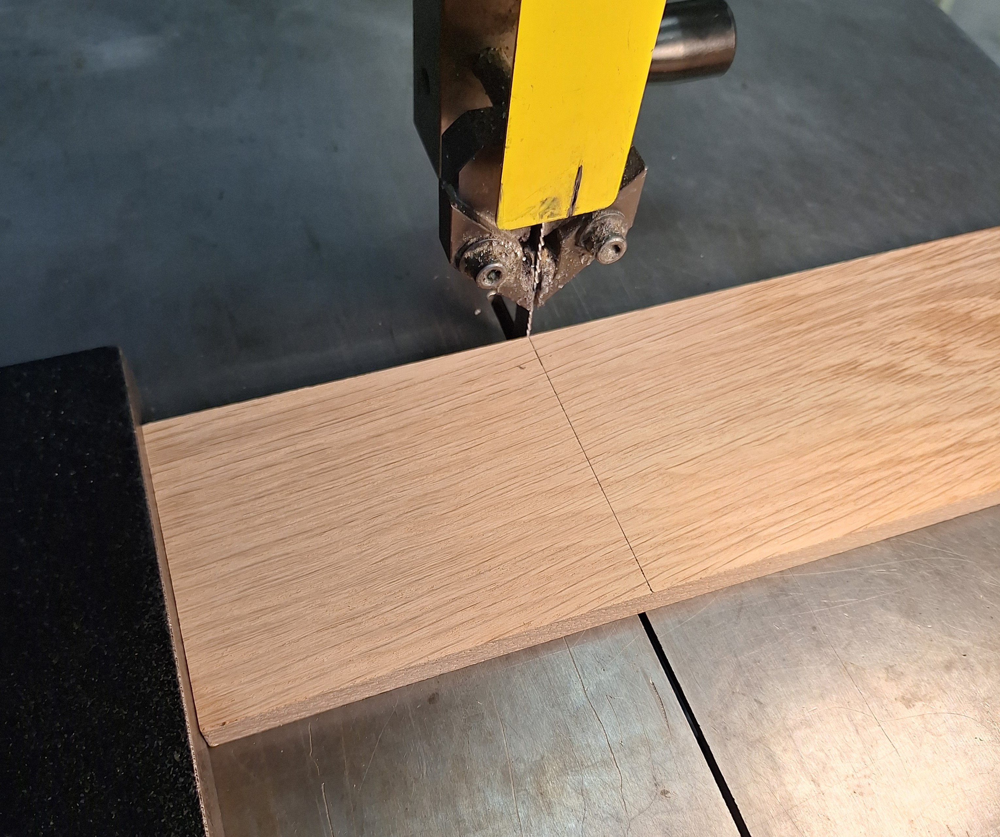
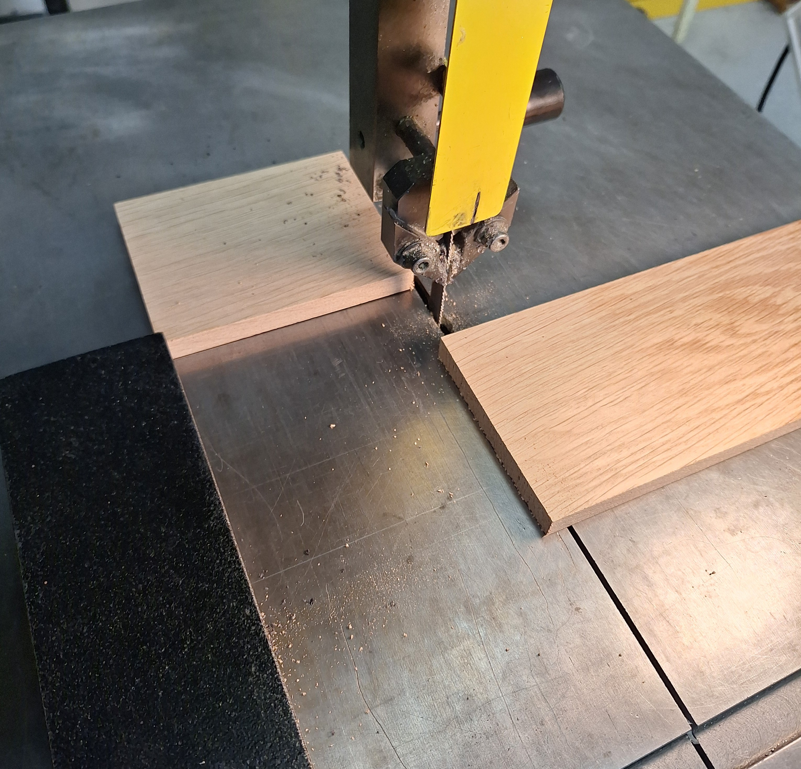
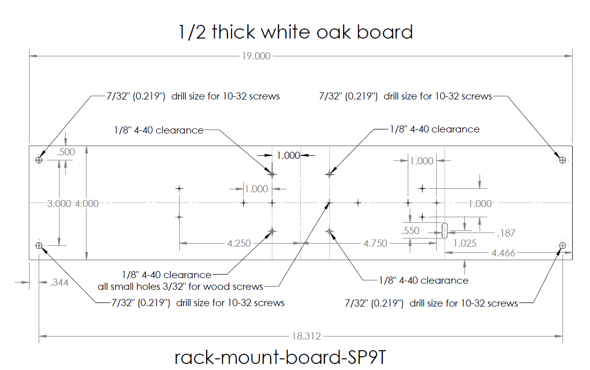
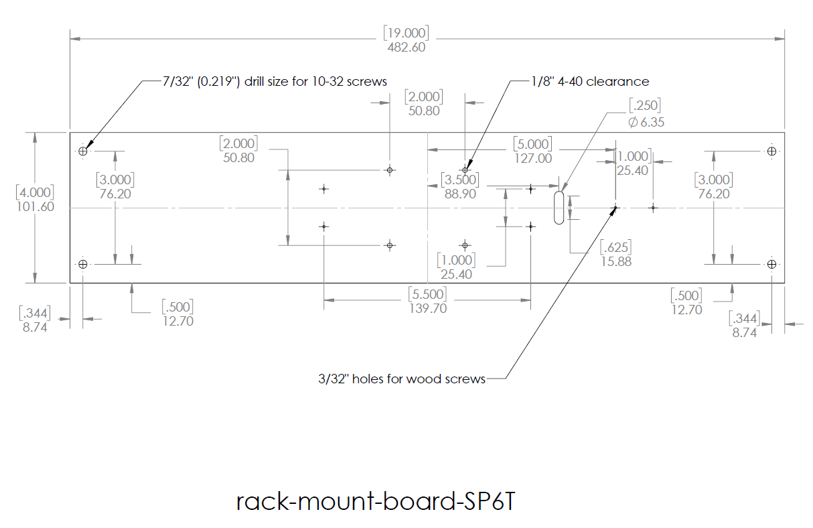

## [../](../)

# MEMSDuino Wood Files

## [files.html](files.html)

## [webeditor.html](webeditor.html)

 
 
 
 
 

For whichever build you are doing, print out the appropriate .pdf in 1 to 1 scale, cut out the templates, tape them together, and use them to transfer information to the wood and then drill all the holes. A hand drill is sufficient for this build.  Use #6 wood screws to attach 3d printed brackets to the wood and 3/4" long 4-40 brass socket head screws to attach the die-cast aluminum enclosure to the board. Brass Flared-Collar Knurled-Head Thumb Screws 10-32 Thread Size, 3/4" Long, McMaster Carr part number 92421A645 is used to mount the instrument in a 19 inch rack mount, assuming 10-32 threads on the rack.

 - [rack-mount-board-SP6T.pdf](rack-mount-board-SP6T.pdf)
 - [rack-mount-board-SP9T.pdf](rack-mount-board-SP9T.pdf)

## All Files

 - [MEMSduino-wood.zip (all files)](MEMSduino-wood.zip)
 - [rack-mount-board-SP6T.SLDDRW](rack-mount-board-SP6T.SLDDRW)
 - [rack-mount-board-SP6T.SLDPRT](rack-mount-board-SP6T.SLDPRT)
 - [rack-mount-board-SP6T.pdf](rack-mount-board-SP6T.pdf)
 - [rack-mount-board-SP6T.png](rack-mount-board-SP6T.png)
 - [rack-mount-board-SP9T.SLDDRW](rack-mount-board-SP9T.SLDDRW)
 - [rack-mount-board-SP9T.SLDPRT](rack-mount-board-SP9T.SLDPRT)
 - [rack-mount-board-SP9T.pdf](rack-mount-board-SP9T.pdf)
 - [rack-mount-board-SP9T.png](rack-mount-board-SP9T.png)

## Parts and Tools needed
 
 - #6 wood screws
 - Knurled 10-32 screws 
 - 1/8 inch drill bit
 - 3/32 inch drill bit
 - 1/4 inch drill bit
 - 7/32 inch drill bit
 - Wood saw
 - Awl or other sharp metal point
 - Scissors, tape, printer, pen

